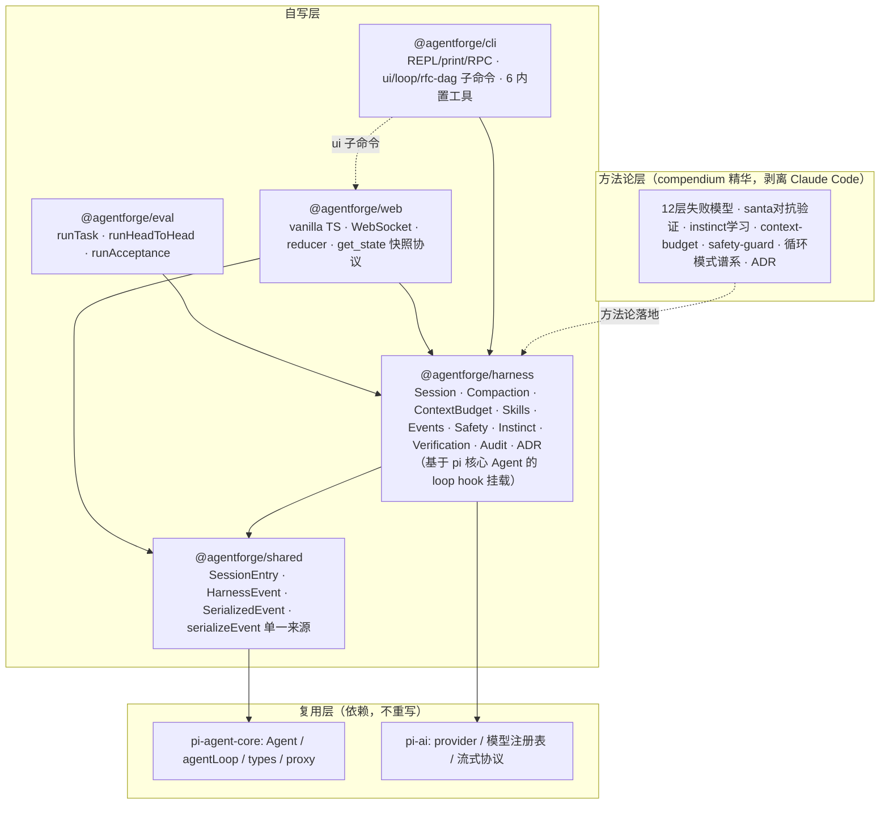
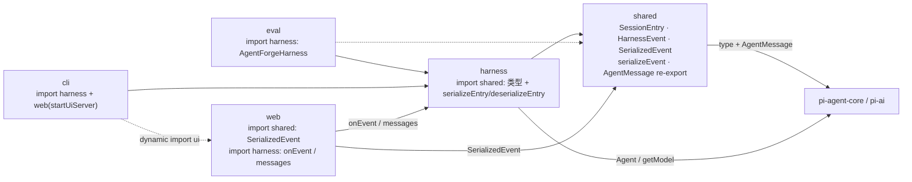
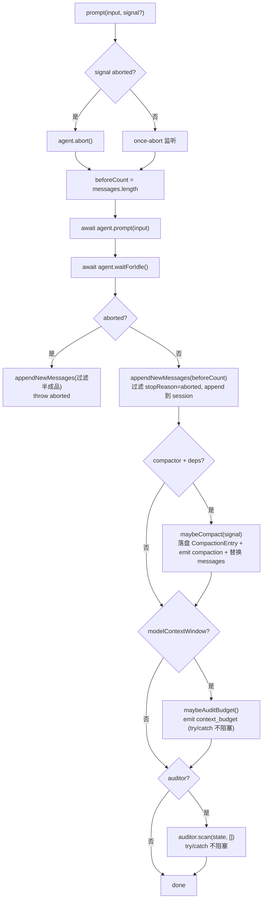
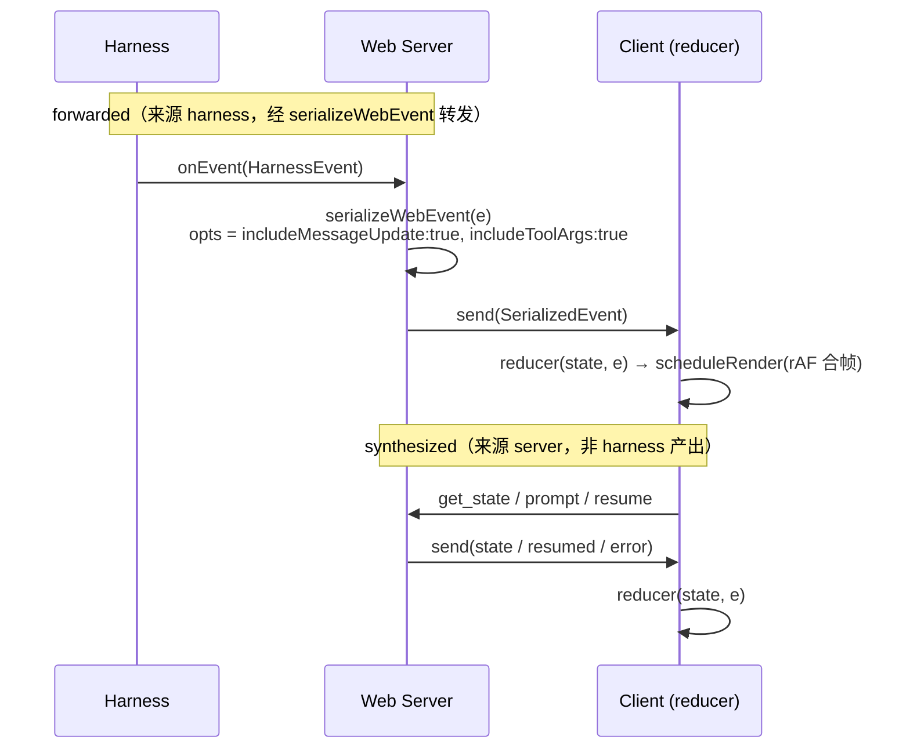
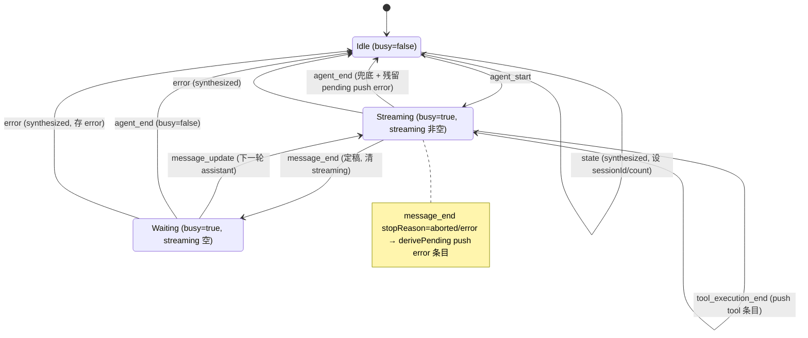
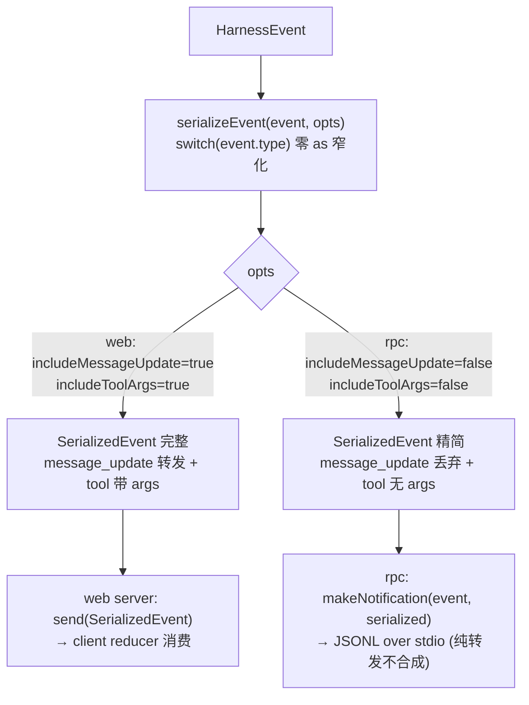

# AgentForge 架构设计

> 基于 pi 核心(`pi-ai` + `pi-agent-core` 的 Agent/agentLoop)自写 harness 与 coding-agent 外壳,把 ECC compendium 的 agent 方法论作为一等公民设计进 harness 层。
>
> 本文是**架构现状文档**(what is),反映截至 2026-07-05 的实际实现。设计动机与 compendium 映射见各节交叉引用。开发规范见 `AGENTS.md`,协议层术语见 `CONTEXT.md`。

---

## 1. 设计原则

1. **不重造 provider 与 loop**。`pi-ai`(30+ provider 适配、流式、模型注册表)和 `pi-agent-core` 的 `Agent`/`agentLoop`(streaming、sequential/parallel 工具执行、steering/follow-up、stop condition、loop 级 hook)是 pi 最大的工程价值且已做对,作为依赖复用。
2. **harness 层自己写**。Session/compaction/skills/hooks/权限/学习/验证/审计是 compendium 方法论落地处,自己写才能把 12 层失败模型、santa、instinct、context-budget 设计成一等公民,而不是外挂。
3. **不围绕 Claude Code**。agentforge 是独立 code agent,不照搬 Claude Code 的概念名(无 `claude -p`、无 `~/.claude/`、无 `/orchestrate`、无 plugin namespace)。compendium 里 Claude Code 耦合的部分被剥离或改造(见 §11)。
4. **方法论 → 模块**。每条 compendium 方法论落到一个 harness 模块,有明确接口和挂载点,不靠 prompt 约定。
5. **vertical slice 推进**。每个 slice 端到端可运行,先验证链路再叠能力。Slice 0–7 已全部落地(见 §13)。
6. **协议层单一来源**。wire 事件形状(`SerializedEvent`)与序列化逻辑(`serializeEvent`)集中在 `shared` 包,web/rpc 两 adapter 通过 opts 切换,消除三处手写平行(见 §7)。

---

## 2. 分层架构



复用边界:复用 `Agent` 类与 `agentLoop`/`agentLoopContinue` 函数、`AgentTool`/`AgentMessage`/`AgentState`/`AgentLoopConfig` 类型、`pi-ai` 的 `getModel`/`stream`/`registerApiProvider`/`completeSimple`/`getEnvApiKey`。**不复用** pi 的 `harness/` 目录(Session/compaction/env/AgentHarness)与 `pi-coding-agent` 包(CLI/TUI/扩展)——这些是自写层,可读作蓝本。

---

## 3. 项目结构

pnpm monorepo,5 个 workspace 包,依赖单向:

```
agentforge/
├── packages/
│   ├── shared/     # 共享类型 + 事件序列化单一来源（依赖 pi-agent-core）
│   ├── harness/    # 自写 harness 核心（依赖 shared + pi-ai + pi-agent-core）
│   ├── eval/       # 评测/基准（依赖 harness + shared + pi-ai）
│   ├── cli/        # coding-agent 外壳 + 内置工具（依赖 harness + shared + web + pi-ai）
│   └── web/        # Web UI + WebSocket server（依赖 harness + shared + cli + ws）
├── research/       # 只读：compendium 全文 + 索引（方法论参考）
├── docs/
│   ├── adr/        # 架构决策记录（0001-deferred-decisions）
│   ├── research/   # 研究笔记
│   └── superpowers/{plans,specs}/  # 各 slice 的 plan + spec 设计文档
├── ARCHITECTURE.md # 本文档（架构现状）
├── CONTEXT.md      # 协议层领域词汇
├── AGENTS.md       # 开发规范（注入 system prompt）
└── ...
```

**依赖链**:`shared ← harness ← {eval, cli} ← web`。`cli` 通过 dynamic import 调 `web` 的 `startUiServer`(`agentforge ui` 子命令)。各包 import 粒度(谁 import 谁的什么符号):



所有包 `private: true`、`type: module`、`version: 0.0.0`,统一外部依赖 `@earendil-works/pi-agent-core` ^0.79.9 + `@earendil-works/pi-ai` ^0.79.9(lockstep 跟随 pi)。

**exports condition**:`shared`/`harness`/`eval` 暴露 `"development"` condition(指向 `./src/index.ts`,vitest 经此解析到源码);`cli`/`web` 仅 `types`+`import`(指向 dist)。`cli` 另有 4 个 subpath exports(`./repl`/`./print-mode`/`./rpc`/`./tools`)。`web` 的 main 指向 `dist/server/`(tsconfig 只编译 server 端,client 由 esbuild 打包)。

---

## 4. 自写 harness 模块(`@agentforge/harness`)

每个模块给出:实现状态 / 职责 / 核心接口 / 与设计 sketch 的偏差。文件位于 `packages/harness/src/`。10 模块中 **9 个完整实现,1 个部分实现**(Audit 仅 2/12 层)。

主类 `AgentForgeHarness`(`harness.ts:126-521`)包装 pi 核心 `Agent`,挂载点见 §4.11。

### 4.1 Session ✓ 完整

- **文件**:`session.ts`(135 行)+ `jsonl-storage.ts`(83 行)
- **职责**:会话状态持久化。树形(支持分支/fork),JSONL 落盘,支持自定义 entry 类型。
- **核心接口**:
  ```ts
  interface SessionStore {
    getLeafId(): string; setLeafId(id: string): void;
    appendEntry(e: SessionEntry): string;
    getEntry(id: string): SessionEntry | undefined;
    getPathToRoot(leafId: string): SessionEntry[];
    moveTo(leafId: string, branchSummary?: string): void;
  }
  ```
  实现:`createMemorySession()`(内存,appendEntry 自动填 entryId/parentId/timestamp)、`createJsonlSession(path)`(JSONL 落盘,损坏行跳过)、`rebuildMessages(entries)`(`--resume` 用,取路径最末端 CompactionEntry 作锚点注入 summary)。
- **SessionEntry 联合**(定义于 `shared/src/index.ts:7-39`):`message` | `compaction` | `branch_summary` | `custom`(kind 字段预留 instinct/adr/audit,但实际三者各自独立持久化)。
- **偏差**:`moveTo` 的 `branchSummary` 参数当前未持久化(仅切 leafId,预留接口)。

### 4.2 Compaction ✓ 完整

- **文件**:`compaction.ts`(240 行)
- **职责**:上下文压缩。token 阈值主触发 + 可注入 `isAtStageBoundary` 谓词 + `stageMarkers` 字符串数组标记检测,三者任一命中即压缩。切点保 turn 完整(对齐 user 消息边界),LLM 生成 summary,提取 fileOps。
- **核心接口**:
  ```ts
  interface Compactor {
    shouldCompact(ctx: CompactionContext): boolean;
    compact(ctx: CompactionContext, deps: CompactDeps): Promise<CompactionResult>;
  }
  ```
  `CompactDeps.generateSummary` 由 cli 注入(用 `pi-ai` `completeSimple` 非流式跑 `SUMMARIZE_PROMPT`)。token 估算用 chars/4 启发式(pi-ai 未暴露 tokenizer)。
- **挂载**:**不用 `transformContext` hook**(纯变换无 session 访问,不适合持久化 CompactionEntry)。harness 在 `prompt` turn 间主动调 `maybeCompact`(`harness.ts:475-520`):`shouldCompact` → `compact` → 落盘 CompactionEntry → emit `compaction` 事件 → 替换 agent messages 为 `[summaryMessage, ...kept]`。整体 try/catch:abort 静默,非 abort emit `compaction_error` 不 rethrow。
- **compendium 映射**:`strategic-compact`(阶段边界 compaction 决策表)。

### 4.3 ContextBudget ✓ 完整

- **文件**:`context-budget.ts`(171 行)
- **职责**:审计 system prompt / skills / tools / history / memory 的 token 开销,给出优化建议(哪个 skill 该降级 LIBRARY、哪个 tool schema 太大、history 是否该 compaction)。pi 无此模块,完全自写。
- **核心接口**:
  ```ts
  interface ContextBudget {
    audit(input: BudgetAuditInput): BudgetReport;
    headroom(total: number, modelContextWindow: number): number;
  }
  ```
  `BudgetComponents` 含 `memory?` 字段(instinct block);`DEFAULT_THRESHOLDS`:skillsBlock=2000 / toolSchema=500 / historyRatio=0.8。
- **挂载**:harness `prompt` 每 turn 完成后调 `maybeAuditBudget`(`harness.ts:410-443`),有 suggestions 或 headroom 不足则 emit `context_budget` 事件(诊断性,try/catch 不阻塞)。cli 三模式经 `createCompactionConfig` 注入 `modelContextWindow`(= `getModel(provider,model).contextWindow`)/`budgetThresholds`。
- **compendium 映射**:`context-budget`("MCP 是最大杠杆,每 tool schema ~500 tokens")。

### 4.4 Skills ✓ 完整

- **文件**:`skills.ts`(255 行)
- **职责**:按需加载方法论 skill(SKILL.md + frontmatter)。DAILY(常驻 system prompt)vs LIBRARY(按需)分类,注入 `<available_skills>` 块。
- **核心接口**:
  ```ts
  loadSkills(dirs: string[], defaultClassifications?): Skill[];
  classifySkill(skill, repoEvidence?): "daily" | "library";
  formatSkillsForSystemPrompt(daily: Skill[]): string;   // 空列表返 ""
  invokeSkill(name, skills): string;                     // Slice 1 占位,返回 content
  ```
  skills 目录三级(cli `system-prompt.ts:33`):`~/.agents/skills` + `~/.agentforge/skills` + `<cwd>/.agentforge/skills`。frontmatter 解析为手写最小 YAML(扁平 key:value)。
- **偏差**:`invokeSkill` 是占位(返回 content 供 caller 处理),非模型驱动执行。
- **compendium 映射**:`agent-sort`(DAILY/LIBRARY 证据驱动分类)+ `skill-stocktake`。

### 4.5 Events ✓ 完整

- **文件**:`events.ts`(52 行)
- **职责**:harness 级事件总线。pi 核心 `Agent.subscribe` 是事件源,harness EventBus 在其上叠加自定义事件与通配符订阅。
- **核心接口**:
  ```ts
  interface EventBus {
    on(type: string, handler: EventHandler): Unsubscribe;  // "*" 通配符接收所有
    emit(event: HarnessEvent): void;
  }
  ```
  emit 同步遍历,异步 handler fire-and-forget(无 await 屏障)。
- **HarnessEvent 联合**(定义于 `shared/src/index.ts:56-135`):`AgentEvent`(pi) | harness 自定义(`compaction`/`compaction_error`/`instinct_observed`/`audit_finding`/`adr_recorded`/`context_budget`/`tool_execution_end`)。discriminated union,每个成员有 `type` 字面量。
- **偏差**:sketch 写 `on<T>` 泛型,实际非泛型(简化);emit 无异步屏障(sketch 描述"异步屏障"略有偏差)。

### 4.6 Safety ✓ 完整

- **文件**:`safety.ts`(100 行)
- **职责**:工具执行权限。allow/deny/ask 规则引擎 + freeze mode(锁定可写目录)+ 破坏性命令拦截。pi 无内置权限,完全自写。
- **核心接口**:
  ```ts
  interface SafetyGuard {
    check(ctx: SafetyContext): "allow" | "deny" | "ask";
    freeze(allowDir: string): void;
    unfreeze(): void;
  }
  ```
  `DEFAULT_SAFETY_RULES`:`bashDenyPatterns`(`rm -rf` / `git push --force` / `git reset --hard` / `DROP TABLE` / `DELETE FROM` / `chmod -R 777` / `curl|sh` / `>/dev/sd` 等)+ `bashAskPatterns`(`git push` / `npm publish` / `rm`)。write/edit 在 freeze 时路径不在 allowDir → deny。
- **挂载**:`beforeToolCall` hook(`harness.ts:191-200`)→ `applySafety`(`harness.ts:264-283`):deny→`{block:true}`, allow→undefined, ask+handler→handler 结果, ask 无 handler→降级 deny。cli REPL 经 `makeReadlineAskHandler` 提供 y/n 交互。
- **compendium 映射**:`safety-guard`(careful/freeze/guard 三模式 + watched patterns)。

### 4.7 Instinct ✓ 完整

- **文件**:`instinct.ts`(294 行)
- **职责**:从工具使用观察中学习 atomic instinct(一个 trigger → 一个 action),带 confidence(0.3–0.9)+ project-scoped(按 git remote hash 隔离)。pi 无此模块,完全自写。
- **核心接口**:
  ```ts
  interface InstinctStore {
    observe(event: HarnessEvent): void;     // 订阅 "*" 积累 observations.jsonl
    loadInstincts(): Instinct[];             // project + global 合并
    extract(signal?): Promise<void>;         // 后台分析(用 completeSimple)
  }
  ```
  `Observation` kind:tool_call / user_message / assistant_message / tool_error。`extract`:读 observations.jsonl → 体积 backstop → 调 extractRun → 同 trigger merge(confidence +0.1 cap 0.9,evidence 追加去重 cap 5)。
- **三阶段挂载**:
  - **apply**(构造时,`harness.ts:167-180`):`loadInstincts` → filter confidence>=0.5 → sort desc → cap 20 → `formatInstinctsForSystemPrompt` 生成 `<learned_instincts>` 块,拼到 systemPrompt。
  - **observe**(构造时,`harness.ts:223-225`):`events.on("*", e => instinct.observe(e))`。tool_execution_end 跳过无 args 的 pi 原生事件(prefer-args 去重);bash command 先 redact secret pattern。
  - **extract**(session end):cli print/repl 在 session end 调 `harness.extract()`;rpc 注释说明 DEFERRED。
- **偏差**:`promote(id)`(project → global 升级)未实现;`apply` 不在 store 内,由 harness 外部完成。
- **compendium 映射**:`continuous-learning-v2`(instinct 模型 + confidence + project scope + hook 100% 观察)。

### 4.8 Verification ✓ 完整

- **文件**:`verification.ts`(280 行)
- **职责**:对抗验证。generator 产出 → 2 个独立 reviewer(无共享上下文,同 rubric)→ verdict gate(AND 语义)→ fix-until-nice 收敛循环(max 3 轮,每轮 fresh reviewer)。基于 pi 核心 `Agent` spawn in-process 子 agent(ADR-0001b 决策,非 RPC 独立进程)。
- **核心接口**:
  ```ts
  interface SantaVerifier {
    review(output, rubric): Promise<ReviewResult>;          // Promise.all spawn 2 reviewer
    verifyUntilNice(initialOutput, rubric, fixFn, maxRounds?): Promise<VerifyUntilNiceResult>;
  }
  ```
  reviewer 用 `submit_review` 工具(typebox schema)回 verdict+issues;`extractReviewerVerdict` 扫 assistant toolCall 取最后一个 submit_review;`gateReview` AND gate,issues flatMap 合并。
- **挂载**:`harness.verify(output, rubric)`(`harness.ts:290-295`)委托 verifier,未注入 throw。不自动触发,由 caller 显式调。cli RPC 模式 `createSantaVerifier`(`rpc.ts:254`)支持 `verify` method。
- **compendium 映射**:`santa-method`(双独立审查 + verdict gate + fix-until-nice)+ `verification-loop`(确定性 build/lint/test 阶段)。

### 4.9 Audit ◐ 部分(2/12 层)

- **文件**:`audit.ts`(251 行)
- **职责**:12 层失败模型诊断。作为诊断模块 + 事件检测器,出 severity-ranked findings + code-first fix plan。
- **核心接口**:
  ```ts
  interface Auditor {
    scan(state: AgentState, events: HarnessEvent[]): Finding[];
    subscribe(events: EventBus): void;
    readonly activeLayers: string[];
  }
  ```
  `Finding`:severity + title + mechanism + sourceLayer + rootCause + evidenceRefs + confidence + recommendedFix。
- **实现状态**:**仅 2 层**(`DEFAULT_LAYERS = ["tool-execution", "answer-shaping"]`):
  - `toolExecutionChecker`(层 7):扫 assistant toolCall,排除 aborted/in-flight,无对应 `tool_execution_end` event → critical finding(幻觉执行)。
  - `answerShapingChecker`(层 9):最后一条无 toolCall 的 assistant message 空/纯空白 → medium finding。
  - 环形 buffer(BUFFER_CAP=1000)累积 events,溢出 emit low finding;scan 后 per finding emit `audit_finding`。
- **未实现**:memory contamination / tool discipline failure / hidden repair loops / rendering corruption 等其余 10 层未建。
- **挂载**:harness `prompt` 末尾 `auditor.scan(state, [])`(try/catch 不阻塞);构造时 `auditor.subscribe(events)`。
- **compendium 映射**:`agent-architecture-audit`(12 层 stack + 失败模式 + severity model)——当前为子集实现。

### 4.10 ADR ✓ 完整(轻量文件型)

- **文件**:`adr.ts`(143 行)
- **职责**:捕获架构决策为结构化 ADR(Context/Decision/Alternatives/Consequences),存 `docs/adr/`。
- **核心接口**:
  ```ts
  recordAdr(record: AdrRecord, opts?): string;   // 写 <dir>/docs/adr/<id>-<slug>.md,返回路径
  listAdrs(opts?): AdrRecord[];                   // 读 docs/adr/*.md 解析
  ```
- **偏差(重要)**:`AdrRecordedEvent`(`{ type: "adr_recorded"; adrId }`)在 `shared` 定义了(`index.ts:79-82`),但 **ADR 模块本身不 emit 此事件**(red-team Advisory 7 决策:adr_recorded 无 consumer,仅 theater)。`serializeEvent` 白名单也不含它(`serialize-event.test.ts:344` 确认 → undefined)。故 `AdrRecordedEvent` 是定义了但无 emitter 的死类型。
- **compendium 映射**:`architecture-decision-records`。

### 4.11 AgentForgeHarness 主类

`harness.ts:126-521`,包装 pi 核心 `Agent`。

**构造**(`harness.ts:148-232`):
1. instinct apply:`loadInstincts` → 格式化 → `instinctBlock`,存 `_baseSystemPrompt` + `_instinctBlock`(budget audit 用,避免双重计数)。
2. `new Agent`:`systemPrompt = opts.systemPrompt + instinctBlock`、`model = getModel(provider, model)`、tools、initialMessages(`--resume` 用)、getApiKey/streamFn 注入。
   - `beforeToolCall` → `applySafety`
   - `afterToolCall` → emit `HarnessToolExecutionEndEvent`(**带 args**,区别于 pi 原生无 args 版本,共享 `tool_execution_end` type 判别式,`serializeEvent` 用 `"args" in event` 守卫)
   - **无 `transformContext`**(见 §4.2)
3. `agent.subscribe(e => events.emit(e))`:pi 事件 → EventBus。
4. `events.on("*", e => instinct.observe(e))`、`auditor.subscribe(events)`。

**prompt 流程**(`harness.ts:331-380`):


**公共 API**:`agent` / `messages` getter、`onEvent(handler)`、`applySafety(input)`、`verify(output, rubric)`、`extract(signal?)`、`verifier` / `instinctStore` getter。

---

## 5. coding-agent 外壳(`@agentforge/cli`)

文件位于 `packages/cli/src/`。bin 为 `agentforge`(`./dist/index.js`)。

### 5.1 子命令与三模式(`index.ts:19` `main()`)

argv 路由:子命令优先于 flag。

| 调用 | 入口 | 说明 |
|---|---|---|
| `agentforge ui` | `index.ts:36-54` | dynamic import `@agentforge/web` 的 `startUiServer`,启动 Web UI(§6) |
| `agentforge loop` | `index.ts:74-90` → `loop/loop-mode.ts` | 自动循环 agent(§5.4),tools/systemPrompt/safety 由 `createLoopAgentDeps()` 注入 |
| `agentforge rfc-dag` | `index.ts:59-70` → `rfc-dag/rfc-dag-mode.ts` | DAG 任务分解(§5.4) |
| `agentforge -p`/`--print` | `print-mode.ts:130` | 单轮对话,`createMemorySession`,输出最终 assistant 文本到 stdout |
| `agentforge --rpc` | `rpc.ts:231` | JSON-RPC 2.0 over stdio,支持 `prompt`/`verify` method,带 `promptTimeoutMs` |
| `agentforge`(默认) | `repl.ts:204` | readline 逐行 REPL,`createJsonlSession` 持久化,支持 `--resume`/`--session`,`/instincts` 命令 |

`--print` 与 `--rpc` 互斥。三模式都已实现。REPL/rpc 共享 `buildHarness`(`repl.ts:106`)。

### 5.2 内置工具(6 个,`tools/`)

实际实现 **6 个工具**(NOT 7,设计文档提到的 `ls` 未实现):

| 工具 | 文件 | 实现 |
|---|---|---|
| read | `tools/read.ts:26` | `node:fs/promises.readFile`,支持 offset/limit |
| bash | `tools/bash.ts:27` | `node:child_process.exec`,非零退出码 throw |
| edit | `tools/edit.ts:29` | 精确字符串替换,old_string 须唯一(除非 replace_all) |
| write | `tools/write.ts:26` | `writeFile`,父目录自动 `mkdir recursive` |
| grep | `tools/grep.ts:44` | **依赖系统 `rg` 二进制**,经 exec 调用,rg 不存在 throw "ripgrep not installed" |
| glob | `tools/glob.ts:110` | 自实现 `globToRegExp`,不依赖外部二进制,跳过 node_modules/.git/dist,上限 1000 |

**grep 的 rg 依赖**:经 `node:child_process` exec 调用真实 `rg` 可执行文件。Claude Code 内置 bash 的 `rg` 是 shell function(node exec 不可调),会话内对话时 grep 会 throw,LLM 收到 error 可改用 bash 替代;用户独立终端运行 agentforge 需自装 ripgrep(`cargo install ripgrep` / `scoop install ripgrep`)。glob 无此依赖。

工具 observation 遵循 compendium 格式:`execute` 返回 `{ content, details }`——`content` 进 LLM,`details` 供 UI/audit 不进 LLM,失败 throw 不编进 content。

### 5.3 配置与项目上下文

**settings.json 两级合并未实现**(设计文档 §5 描述的 `~/.agentforge/settings.json` + `<cwd>/.agentforge/settings.json` 在源码中无任何实现)。实际配置通路:

- **provider/model**:`print-mode.ts:56-57` `DEFAULT_PROVIDER = "xiaomi-token-plan-cn"` / `DEFAULT_MODEL = "mimo-v2.5-pro"`,经 argv `--provider`/`--model` 覆盖。
- **API key**:`env-config.ts:20` `getApiKeyFromEnv` 封装 pi-ai `getEnvApiKey`(按 pi-ai env-api-keys 约定)。
- **skills 目录**:三级(§4.4)。
- **session 目录**:`repl.ts:190` `<cwd>/.agentforge/sessions`。
- **instinct 数据目录**:默认 `~/.agentforge`。
- **compaction 开关**:`compaction-config.ts:61` 读 env `AGENTFORGE_DISABLE_COMPACTION`。
- **project hash**:`instinct-config.ts:93` env `AGENTFORGE_PROJECT_DIR` > git remote > git repo path。

**项目上下文**(`system-prompt.ts`):`loadAgentsMd` 读 `<cwd>/AGENTS.md`(NOT CLAUDE.md),`createSystemPromptWithSkills` 拼接顺序 `basePrompt + AGENTS.md + daily skills 块`。三模式 + loop 均接通。

**compaction/context-budget 接通**(`compaction-config.ts:75` `createCompactionConfig`):返回 `compactor`(或 `DISABLED_COMPACTOR`)+ `compactorDeps`(`generateSummary` 用 `completeSimple`)+ `modelContextWindow`(`getModel().contextWindow`)+ `budgetThresholds`。三模式(print `print-mode.ts:154`、repl/rpc `repl.ts:120`、loop 复用)均注入 harness。

### 5.4 循环模式子命令(超出原设计)

- **`loop/`(continuous-PR)**:`LoopRunner` 主循环 + `InProcessAgentRunner` + `exit-condition`(maxRuns/maxCost/maxDuration/completion)+ `LocalBuildGate`(typecheck/test 门槛)+ `DryRunGitOps` + `FileSharedTaskNotes`(`<cwd>/.agentforge/loop`,iteration 日志)。
- **`rfc-dag/`(RFC-DAG)**:`RfcDagRunner` + `FileRfcDagState` + `DagDecomposer`(任务分解)+ `DagScheduler`(分层调度)+ `DryRunWorktreeOps`(worktree 隔离)。
- **compendium 映射**:`continuous-agent-loop`/`autonomous-loops`(模式谱系)+ `ralphinho-rfc-pipeline`(worktree + 分层管线)。

---

## 6. Web UI 与协议层(`@agentforge/web`)

文件位于 `packages/web/src/`。整体架构:**vanilla TS(非 React)+ tsc/esbuild(非 Vite)+ 单 WebSocket 通道**。

```
packages/web/src/
├── server/                  # Node server 端(tsc 编译)
│   ├── index.ts             # startUiServer 主入口
│   ├── ws-protocol.ts       # serializeWebEvent + parseClientMessage
│   └── index.test.ts / ws-protocol.test.ts
└── client/                  # 浏览器前端(esbuild 打包)
    ├── main.ts              # vanilla TS UI + WS client
    ├── reducer.ts           # 纯函数 reducer + derivePending
    ├── index.html / style.css
    └── reducer.test.ts
```

### 6.1 整体架构

| 维度 | 实现 |
|---|---|
| 前端 | **vanilla TS**,`document.getElementById` 直接操作 DOM,markdown 用 `marked` |
| 后端 | `http.createServer` + `WebSocketServer({ server })` 挂同一 http server(`ws` ^8.18.0) |
| 构建 | **tsc + esbuild**,client 经 esbuild 打包为单文件 ESM bundle + 复制 html/css;server 走 tsc |
| 启动 | `httpServer.listen(deps.port ?? 0, deps.host ?? "127.0.0.1")`,默认随机端口 + 127.0.0.1。由 `agentforge ui` 触发,启动后 `console.error` 打印 `open: http://127.0.0.1:${bound}` |
| 通信 | 单一 WebSocket。http server 仅托管 4 个静态路由(`/`/`/index.html`/`/bundle.js`/`/style.css`),其余 404 |

### 6.2 WebSocket 事件流

**Server → Client 事件两类来源**(协议层核心区分,见 `CONTEXT.md`):

- **forwarded(转发,来源 harness)**:`harness.onEvent(e) → serializeWebEvent(e) → send(s)`(`server/index.ts:44-50`)。每个事件直发,背压由前端 rAF 合帧吸收。
- **synthesized(合成,来源 server)**:`state` / `resumed` / `error`,在 `handleGetState`/`handleResume`/`handlePrompt` catch 中直接 send。

**Client 消费**(`client/main.ts:84-89`):`ws.onmessage` → `JSON.parse` → `resumed` 由 main 拦截设 sessionId → `reducer(state, e)` → `scheduleRender()`(rAF 合帧)。



### 6.3 reducer 与 ServerEvent 联合

`reducer.ts:58` `function reducer(state: State, event: ServerEvent): State`。

**ServerEvent 派生(非手写)**(`reducer.ts:49`):
```ts
export type ServerEvent = SerializedEvent | ServerControlEvent;
```
- `SerializedEvent` = forwarded 子集,从 `shared` import(wire 形状单一来源,§7)。
- `ServerControlEvent` = synthesized 子集(`reducer.ts:38-41`):`state` | `resumed` | `error`。

reducer switch(`reducer.ts:59-122`)按 `event.type` 字面量落到不同 case:`agent_start`/`message_update`/`message_end`/`agent_end`/`context_budget`/`tool_execution_end`(forwarded)+ `error`/`state`(synthesized)+ `default`(`compaction`/`compaction_error`/`audit_finding`/`resumed`/`message_start` 原样返回)。

**forwarded vs synthesized 区分**:不靠运行时分类标记,靠 `event.type` 字面量在 switch 中落到不同 case;类型系统层面由 `SerializedEvent` 与 `ServerControlEvent` 两个子集联合表达。

reducer 状态转移(busy × streaming 主轴,三态):



### 6.4 get_state 快照协议(P2-1)

`server/index.ts:80-90` `handleGetState`:
```ts
send({
  type: "state",
  ...(id !== undefined ? { id } : {}),   // echo 客户端请求 id
  sessionId,
  isStreaming: busy,
  isCompacting: false,                    // 同步压缩无可观测窗口
  messageCount: harness.messages.length,
  pendingMessageCount: 0,                 // P1 无消息队列
});
```
- **只读语义**:get_state 在 busy 期间可调用不打断 turn。
- **resume bug 修复**:`handleResume` 更新 server `sessionId` 变量(否则 resume 后 get_state 返回旧 id,测试 `index.test.ts:211-244` 锁此修复)。

### 6.5 pendingTools / isError 渲染(P2-2)

**`derivePending` 纯函数**(`reducer.ts:125-158`):扫 messages 中 assistant toolCalls,未在 executed(已 role:"tool")且未 seen → push。**不存 State**:tool 条目进 messages 即进 executed → pending 自清。

**isError 渲染**:`RenderedMessage` tool 形状含 `status: "done"|"error"` + `isError: boolean`。三路径 push error(message_end aborted/error、agent_end 兜底、synthesized error);`tool_execution_end` 透传 `isError`。`main.ts` 渲染:`⚠`=error status / `✗`=isError / `✓`=done / `⏳`=pending,tools 计数 `✓${done} ⚠${err} ⏳${pending.length}`。

---

## 7. 协议层:事件序列化(单一来源)

协议层是近期架构深化的核心成果,消除 web/rpc/reducer 三处手写平行。术语沉淀见 `CONTEXT.md`。

### 7.1 serializeEvent(`shared/src/index.ts:197-262`)

```ts
export function serializeEvent(
  event: HarnessEvent,
  opts?: SerializeEventOpts,
): SerializedEvent | undefined
```

- **实现**:`switch(event.type)` discriminant 窄化 HarnessEvent 联合,**零 `as` 重断言**,字段直接 `event.xxx` 读取。
- **SerializeEventOpts**(`index.ts:178-183`):`{ includeMessageUpdate?: boolean; includeToolArgs?: boolean }`,均默认 false(rpc 行为)。
- **9-case 白名单**(返回定义对象)+ 非白名单(返回 undefined,跳过):

| type | 行为 |
|---|---|
| `agent_start` / `agent_end` | type-only(agent_end 丢 messages,messages 在 prompt result 里给) |
| `message_update` | `includeMessageUpdate=false`(默认)→ undefined;true → `{type, message}`(丢 assistantMessageEvent) |
| `message_end` | `{type, message}` |
| `tool_execution_end` | base = `{type, toolCallId, toolName, isError}`;`includeToolArgs && "args" in event` → 加 args;result 永不推 |
| `context_budget` / `compaction` / `compaction_error` / `audit_finding` | 透传字段 |
| `turn_*`/`message_start`/`tool_execution_start`/`tool_execution_update`/`instinct_observed`/`adr_recorded`/未知 | undefined |

### 7.2 SerializedEvent = wire 形状单一来源(`shared/src/index.ts:144-175`)

11 成员联合,`message_update` 与 `tool_execution_end` 各含两种形状(按 opts 开关),故 union 同时包含 args/无 args、message_update 在/不在 的所有可能返回对象。web/rpc/reducer 三处不再手写平行。

### 7.3 web vs rpc adapter 对齐

**web adapter**(`web/src/server/ws-protocol.ts:10-17`):
```ts
export function serializeWebEvent(event: HarnessEvent): SerializedEvent | undefined {
  return serializeEvent(event, { includeMessageUpdate: true, includeToolArgs: true });
}
```
**rpc adapter**(`cli/src/rpc.ts:102-106`):
```ts
const serialized = serializeEvent(e, { includeMessageUpdate: false, includeToolArgs: false });
if (serialized) output.write(makeNotification("event", serialized) + "\n");
```

行为差异:rpc 丢逐 token `message_update` + `tool_execution_end` 不带 args(精简);web 转发 message_update 累积态 + 带 args。两者共享 `shared.serializeEvent` 单一来源,白名单与窄化逻辑无平行实现。

**对齐情况**:
- `agent_start`/`agent_end` 只从 harness 转发,server 不再合成(旧 web `handlePrompt` 曾合成致双发,已删;`server/index.ts:58` 注释明示)。reducer 不再为该双发幂等防御。测试 `index.test.ts:139-172` 锁"每个生命周期事件恰一条"。
- rpc **纯转发不合成任何事件**(无 state/resumed/error);web **合成 state/resumed/error**。



### 7.4 ServerEvent 派生

`ServerEvent` / `ServerControlEvent` **不在 shared**,在 `web/src/client/reducer.ts:38-49` 派生:
```ts
type ServerControlEvent = { type:"state"; ... } | { type:"resumed"; ... } | { type:"error"; ... };
type ServerEvent = SerializedEvent | ServerControlEvent;
```
从 shared 的 `SerializedEvent` 单一来源派生,消除手写漂移。

### 7.5 Task 1 union narrow(AgentMessage 派生)

`shared` 只 re-export pi 的 `AgentMessage`(`index.ts:264-265`),**不扩展 CustomAgentMessages**(pi-agent-core 自扩展 bashExecution/custom/branchSummary/compactionSummary,故 AgentMessage 实为 7 成员 union)。实际 `Extract<>` 派生子类型发生在 `web/src/client/reducer.ts:12-15`:
```ts
export type AssistantMessage = Extract<AgentMessage, { role: "assistant" }>;
export type UserMessage = Extract<AgentMessage, { role: "user" }>;
export type ToolCall = Extract<AssistantMessage["content"][number], { type: "toolCall" }>;
export type Usage = AssistantMessage["usage"];
```
单一来源 re-export,不加 pi-ai 依赖,reducer 派生消费。

---

## 8. 评测(`@agentforge/eval`)

文件位于 `packages/eval/src/`(11 源 + 5 测试)。bin 为 `agentforge-eval`。是 agentforge **自我评测 + head-to-head 配置对比**框架(Slice 7),评测 `AgentForgeHarness` 在不同 `EvalConfig`(provider/model/systemPrompt)下的表现。

**核心流程**:`runTask`(`runner.ts`)构造 `AgentForgeHarness` → `harness.prompt(task.prompt)` → 从 `harness.agent.state.messages` 取最后 `AssistantMessage` 提取 reply/usage(tokens/cost) → `runAcceptance` 声明式校验 sandbox 产物 → 聚合 `Metrics`(completionRate / pass1 / pass3? / totalTokens / totalCost / avgWallClockMs)。

**公共 API**(`index.ts`):`runHeadToHead` + `compare`(markdown 表)+ `parseArgs`/`runCli`/`loadTasks`/`loadConfigs` + 类型(`Task`/`AcceptanceCheck`/`TaskResult`/`EvalConfig`/`SuiteResult`/`Metrics`)。`runTask`/`runSuite` 未从 index re-export,仅内部供 head-to-head 和 cli 调用。

**关键设计决策**(spec red-team 审查后):
- 声明式 `acceptanceChecks`(`file-exists`/`file-contains`/`exit-zero`,避免任意函数,安全 sandbox)。
- drop retries metric(pi 不暴露 retry 计数)。
- cost 用 `usage.cost.total`(pi 预算,不重算)。
- pass3 可选(`--repeats 3` 时填,默认 off)。

**与 compendium agent-eval 对应但是改编版**:compendium §15 是外部 CLI 对比不同 coding agent(claude-code/aider/codex,YAML task + git worktree);agentforge eval 是 workspace 内部包,TypeScript task + sandbox 目录,对比 agentforge 自身 harness 不同 config。设计 spec 见 `docs/superpowers/specs/2026-06-25-slice7-eval-design.md`。

---

## 9. 构建与测试

### 9.1 构建

| 包 | build | 产物 |
|---|---|---|
| shared / harness / eval / cli | `tsc` | `dist/*.js` + `*.d.ts` + `*.map` |
| web | `tsc && esbuild src/client/main.ts --bundle --outfile=dist/client/bundle.js --format=esm && copyfile html/css` | `dist/server/*.js`(tsc) + `dist/client/bundle.js`(esbuild 单文件) |

`tsconfig.base.json`:target ES2023、module/moduleResolution NodeNext、strict、verbatimModuleSyntax、declaration+map。各包 extends base,`outDir: dist`、`rootDir: src`、exclude test。**web 例外**:`outDir: dist/server`、`rootDir: src/server`、`include: ["src/server"]`(只编译 server,client 全由 esbuild)。

根脚本:`build` = `pnpm -r build`、`typecheck` = `pnpm -r typecheck`、`test` = `vitest --run`。engines: node >= 22.19.0。

### 9.2 测试

vitest 单 project 配置(`vitest.workspace.ts`),`include: ["packages/*/src/**/*.test.ts"]`。workspace 包名解析到源码靠各 package.json exports 的 `"development"` condition(vite serve 默认用 development condition → 读 src 而非 dist)。注释:vitest 4 workspace 数组形式 alias 实测不生效,故不配 alias,统一靠 development condition。

**测试规模**(54 文件,~640 用例估算):

| 包 | 测试文件数 | 用例估算 |
|---|---|---|
| shared | 2 | 23 |
| harness | 13 | 221 |
| eval | 5 | 42 |
| web | 3 | 56 |
| cli | 31 | 298 |
| **合计** | **54** | **~640** |

TDD 是 Iron Law(见 `AGENTS.md`):无失败测试则无生产代码。每个 harness 源模块都有对应 .test.ts(safety 有两个:guard 本身 + harness 挂载)。

---

## 10. compendium 方法论 → 模块 落地映射

| compendium skill | 落地模块 | 形态 | 状态 |
|---|---|---|---|
| agent-architecture-audit(12层失败模型) | Audit | 模块 + 诊断 skill | ◐ 2/12 层 |
| agent-harness-construction(harness原则) | 贯穿 | 工具/observation 编码规范 | ✓ |
| continuous-agent-loop / autonomous-loops(循环模式) | cli `loop/` | continuous-PR(SharedTaskNotes 桥) | ✓ |
| ralphinho-rfc-pipeline | cli `rfc-dag/` | RFC-DAG:worktree + 分层管线 | ✓ |
| santa-method | Verification | 模块(核心) | ✓ |
| verification-loop | Verification | 确定性阶段(build/lint/test) | ✓ |
| agent-eval | eval 包 | harness 自评 + head-to-head | ✓ |
| agent-introspection-debugging | skill | 自调试 skill | 规划 |
| continuous-learning-v2 | Instinct | 模块 | ✓ |
| ck | Session | 持久化思想 | ✓ |
| context-budget | ContextBudget | 模块 | ✓ |
| strategic-compact | Compaction | 阶段边界策略 | ✓ |
| safety-guard | Safety | 模块 | ✓ |
| agent-sort | Skills | DAILY/LIBRARY 分类 | ✓ |
| skill-stocktake / skill-comply | Skills | skill 运维 | 部分 |
| architecture-decision-records | ADR | 模块 | ✓ |
| council | skill(`.agentforge/skills/council/`) | 四声决策 skill | ✓ |
| plan-orchestrate | cli(subagent chain) | 思想保留,命名空间机制抛弃 | ✓ |

---

## 11. compendium 剥离清单(不围绕 Claude Code)

**保留并移植**(agent-agnostic):agent-architecture-audit、agent-harness-construction、continuous-agent-loop/autonomous-loops 的模式谱系、ralphinho-rfc-pipeline、verification-loop、santa-method、agent-eval、agent-introspection-debugging、context-budget、strategic-compact、continuous-learning-v2、safety-guard、agent-sort、architecture-decision-records、council。

**剥离或改造**(Claude Code 耦合):
- `agentic-os`(CLAUDE.md kernel + `claude -p`)→ 改造为 `AGENTS.md` + cli RPC 模式。
- `autonomous-agent-harness`(Claude Code crons/dispatch/computer-use MCP)→ 外部 cron + cli `-p`/RPC。
- `plan-orchestrate`(`/orchestrate` + plugin namespace 探测)→ 抛弃命名空间,保留 plan→subagent chain 思想。
- `team-builder`(`claude agents` 命令)→ agentforge agent 目录发现。
- `dmux-workflows`(tmux + claude code)→ 保留 worktree 隔离思想。
- `claude-devfleet`(MCP)→ subagent 扩展替代。
- `skill-stocktake`/`skill-comply`(`~/.claude/skills` 路径)→ 改为 `~/.agentforge/skills`。
- `token-budget-advisor`(Claude Code 特定)→ 思想融入 ContextBudget。
- `prompt-optimizer`(Claude Code prompt)→ 可选保留为 skill。

---

## 12. 与 pi 上游的关系

- **依赖**:`@earendil-works/pi-ai` + `@earendil-works/pi-agent-core`(核心 Agent/agentLoop,不含 harness)。lockstep 跟随 pi 版本(^0.79.9)。升级时审查 changelog 的 hook 接口变更。
- **不 fork pi 核心**:pi 核心作为 npm 依赖,不复制源码。agentforge 只拥有 harness + cli + web + eval 层源码。
- **pi harness 作蓝本**:自写 harness 时参考 pi `harness/` 的实现思路(Session/compaction/skills),但不直接复用代码——因为要内建 compendium 方法论。
- **MIT 兼容**:pi MIT,agentforge 可自由依赖与参考。
- **上游风险**:pi 核心 `Agent`/`agentLoop` 的 hook 接口若 breaking,agentforge harness 要同步适配。锁版本 + minor 升级时审查 changelog。
- **同源参照系**:`open-gsd/gsd-pi` 与 agentforge 同源(pi-agent-core/pi-ai 包同名 + piConfig),是可观测性最直接参照系。

---

## 13. 开发路线图(vertical slices)

每个 slice 端到端可运行,先链路后能力。**Slice 0–7 已全部落地**。

- **Slice 0 — 最小可运行链路** ✓:pi 核心 + 自写 harness 骨架 + CLI(REPL + print + read/bash)。对话 → 工具调用 → 持久化 → 恢复。验证 hook 挂载点。
- **Slice 1 — 上下文治理** ✓:Compaction(阶段边界)+ ContextBudget(审计)+ Skills(DAILY/LIBRARY)。
- **Slice 2 — 安全** ✓:Safety(allow/deny/ask + freeze)挂 beforeToolCall;补 edit/write/grep/glob 工具。
- **Slice 2.5 — cli 三 mode 接通** ✓:print/repl/rpc 三模式接通 compaction/context-budget(`createCompactionConfig` 传 modelContextWindow/compactor/compactorDeps/budgetThresholds)。
- **Slice 3 — 对抗验证** ✓:Verification(santa 双 reviewer + fix loop)+ RPC 模式(供 subagent spawn,`verify` method)。
- **Slice 3.5 — RPC** ✓:JSON-RPC 2.0 over stdio,纯转发不合成事件。
- **Slice 4 — 学习** ✓:Instinct(observe + extract + apply + project scope)。Slice 4a summarize prompt + Slice 4b instinct + T10 prefer-args 去重修复。
- **Slice 5 — 诊断与决策** ◐:Audit(2/12 层)+ ADR + council skill。Audit 待补其余 10 层。
- **Slice 6 — 循环模式** ✓:continuous-PR(`loop/`,SharedTaskNotes 桥)+ RFC-DAG(`rfc-dag/`,worktree + 分层调度)。
- **Slice 7 — 评测** ✓:eval 包(harness 自评 + head-to-head)。
- **Web UI P1** ✓:流式(message_update 整条替换 + rAF 合帧)+ 可观测(context_budget 显示)。
- **Web UI P2-1** ✓:get_state 快照协议(5 字段 + 可选 id,resume bug 修复)。
- **Web UI P2-2** ✓:pendingTools isError 渲染(derivePending 纯函数,删 State.tools,协议零改)。
- **协议层架构深化(A+B+C+H)** ✓:serializeEvent 统一 + 删 web 合成双发 + ServerEvent 派生 + CONTEXT.md 术语沉淀。
- **Task 1 union narrow** ✓:AgentMessage 单一来源 re-export + Extract 派生 + emitToolResultMessage 空气泡 bug 修复。

**后续待办**:Audit 补 10 层(memory contamination / tool discipline failure / hidden repair loops / rendering corruption 等);settings.json 两级合并;`ls` 工具;instinct `promote`;cli RPC 模式 instinct extract(当前 DEFERRED)。

---

## 14. 待定问题(已决策)

> 以下已于 2026-06-22 决策,详见 `docs/adr/0001-deferred-decisions.md`(ADR-0001a-f,每条含 Revisit 触发条件)。

- **REPL 终端 UI**(ADR-0001a):自写 readline 逐行(Slice 2 ✓),pi-tui 推后期。
- **subagent spawn 形态**(ADR-0001b):in-process Agent 默认 + RPC 作 cli 模式并行建(Slice 3 ✓)。
- **instinct 后台分析进程**(ADR-0001c):in-process 低频任务(Slice 4 ✓)。
- **budget/compaction cli 启用时机**(ADR-0001d):Slice 2.5 接通 ✓。
- **compaction 阶段边界真实检测**(ADR-0001e):短期显式 stageMarker + 远期复用 Audit。
- **`@agentforge/ai-extra`**(ADR-0001f):不建,用 pi-ai `registerApiProvider`。
