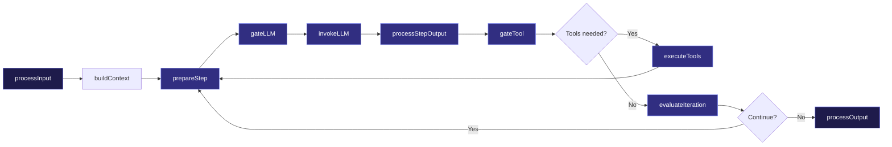

<p align="center">
  
</p>

<h1 align="center">AgentForge</h1>

<p align="center">
  <strong>TypeScript Agent framework where Pipeline is everything.</strong>
</p>

<p align="center">
  Every pipeline stage is simultaneously an <em>extension point</em>, an <em>observability span</em>, and a <em>hook interception point</em>.<br/>
  10 built-in stages · 15+ plugins · any LLM provider
</p>

<p align="center">
  <a href="https://agentforge-docs.vercel.app/"></a>
  <a href="https://www.npmjs.com/package/@agentforge/core"></a>
  <a href="./LICENSE"></a>
  
  <a href="https://github.com/Yamdy/agentforge/stargazers"></a>
</p>

---

## ✨ Highlights

| | |
|---|---|
| 🔌 **Pipeline = Extension Point** | Every stage is a pluggable Processor — inject, reorder, or replace any step |
| 📡 **Pipeline = Observability Span** | Every stage is a traced Span — zero-config OpenTelemetry integration |
| 🪝 **Pipeline = Hook** | Every stage is a hook target — intercept before/after with full context access |
| 🤖 **A2A Protocol** | Native Agent-to-Agent JSON-RPC with streaming — multi-agent out of the box |
| 🛡️ **15+ Production Plugins** | memory, compression, permission, costCap, tokenBudget, rateLimit, PII, moderation... |
| ⏸️ **Session Persistence** | Suspend/resume + checkpoint recovery + JSONL storage |

## Quick Start

```bash
npm install @agentforge/core
```

```typescript
import { Agent, registerProvider } from '@agentforge/core';
import { createOpenAICompatible } from '@ai-sdk/openai-compatible';

// Register any OpenAI-compatible provider
registerProvider('deepseek', (modelId) => {
  const sdk = createOpenAICompatible({
    baseURL: 'https://api.deepseek.com',
    apiKey: process.env.DEEPSEEK_API_KEY!,
  });
  return sdk.languageModel(modelId);
});

// Create and run an agent
const agent = new Agent({
  model: 'deepseek/deepseek-v4-flash',
  systemPrompt: 'You are a helpful assistant.',
  maxIterations: 5,
});

const { response } = await agent.run('Hello!');
console.log(response);
```

<details>
<summary>📦 Using OpenAI / Anthropic / Google</summary>

```typescript
import { Agent, registerProvider } from '@agentforge/core';
import { createOpenAI } from '@ai-sdk/openai';
import { createAnthropic } from '@ai-sdk/anthropic';
import { createGoogleGenerativeAI } from '@ai-sdk/google';

registerProvider('openai',   (m) => createOpenAI({ apiKey: process.env.OPENAI_API_KEY! }).languageModel(m));
registerProvider('anthropic', (m) => createAnthropic({ apiKey: process.env.ANTHROPIC_API_KEY! }).languageModel(m));
registerProvider('google',   (m) => createGoogleGenerativeAI({ apiKey: process.env.GOOGLE_API_KEY! }).languageModel(m));

const agent = new Agent({ model: 'openai/gpt-4o', systemPrompt: 'You are a helpful assistant.' });
```

</details>

## Why AgentForge?

| | AgentForge | AgentScope | DeepAgents | Mastra |
|---|---|---|---|---|
| Language | TypeScript | Python | Python | TypeScript |
| Pipeline extensibility | ✅ Processor + Span + Hook | ⚠️ Pipeline only | ⚠️ LangGraph nodes | ⚠️ Middleware only |
| Production guardrails | ✅ costCap, tokenBudget, rateLimit, PII, moderation | ❌ Not built-in | ❌ Not built-in | ⚠️ Partial |
| A2A protocol | ✅ Native + streaming | ✅ Native | ❌ Third-party only | ⚠️ Manual |
| Suspend & resume | ✅ Checkpoint + JSONL | ⚠️ SQLite session | ⚠️ LangGraph checkpoint | ⚠️ Basic |
| Plugin system | ✅ 15+ built-in, 1-line register | ⚠️ Toolkit + MCP | ⚠️ Skills + MCP | ⚠️ Limited |

## Progressive Examples

### 📡 Observe pipeline events

Every stage emits events — subscribe with zero setup.

```typescript
agent.eventSystem.subscribe('invokeLLM:after', (data) => {
  console.log('LLM call complete', data);
});
```

### 🔌 Add plugins

Swap in production plugins with one line each.

```typescript
import { memoryPlugin, compressionPlugin, permissionPlugin } from '@agentforge/plugins';

const agent = new Agent({
  model: 'deepseek/deepseek-v4-flash',
  systemPrompt: 'You are a helpful assistant.',
  maxIterations: 10,
  plugins: [
    memoryPlugin({ backend: 'sqlite' }),
    compressionPlugin({ maxTokens: 8000 }),
    permissionPlugin({ mode: 'interactive' }),
  ],
});
```

### 🤖 Multi-agent via A2A

Two agents talking over the Agent-to-Agent protocol.

```typescript
import { AgentForgeServer, A2AClient, buildAgentCard, a2aRoutes } from '@agentforge/server';

// Start a researcher agent on port 3001
const server = new AgentForgeServer({ port: 3001 });
server.registry.register('researcher', {
  model: 'deepseek/deepseek-v4-flash',
  systemPrompt: 'You are a research assistant.',
  maxIterations: 2,
});
server.hono.route('/a2a', a2aRoutes({ registry: server.registry, agentId: 'researcher' }));
await server.start();

// Send a task from another agent
const card = buildAgentCard({
  name: 'researcher',
  description: 'Research assistant that generates summaries',
  version: '1.0.0',
  url: 'http://localhost:3001/a2a',
  skills: [{ id: 'summarize', name: 'Summarize', description: 'Summarize a topic', tags: ['research'] }],
});
const client = new A2AClient({ card });
const result = await client.sendMessage('Summarize neural networks in 2 sentences.');
```

### 🛠️ Custom processor

Write your own pipeline stage in 10 lines.

```typescript
import { createFactInjectionProcessor } from '@agentforge/plugins';

const agent = new Agent({
  model: 'deepseek/deepseek-v4-flash',
  systemPrompt: 'You are a helpful assistant.',
  plugins: [
    {
      name: 'inject-time',
      processors: [
        {
          stage: 'buildContext',
          processor: createFactInjectionProcessor({
            facts: { currentTime: () => new Date().toISOString() },
          }),
        },
      ],
    },
  ],
});
```

## Architecture

### Pipeline Stages



The agentic loop repeats until `iteration.loopDirective` is `stop`. Any processor can return an `AbortSignal` to abort with optional `retryFrom` a specific stage.

### Pipeline Context

Every stage receives a `PipelineContext` with four regions:

| Region | Purpose | Contents |
|--------|---------|----------|
| `request` | Immutable input | user message, sessionId |
| `agent` | Configuration | model, systemPrompt, tools, promptFragments |
| `iteration` | Per-step state | step number, response, loopDirective, span |
| `session` | Cross-iteration state | messageHistory, tokenUsage, plugin custom data |

### Package Structure

```
packages/
  sdk/             -- Pure type definitions (zero dependencies)
  tools/           -- Built-in tool implementations
  observability/   -- Span, Tracer, Metrics + OpenTelemetry bridge
  core/            -- Agent, PipelineRunner, LLMInvoker, ToolRegistry, SessionManager
  plugins/         -- 15+ processor plugins
  server/          -- Hono HTTP server, WebSocket, A2A protocol, CLI
```

Dependency flow: `sdk` ← `tools` / `observability` ← `core` ← `plugins` ← `server`.

## Production

### Configuration

Multi-level JSONC config (highest priority first):

1. **Session-level** — runtime params passed to `agent.run()`
2. **Project-level** — `.agentforge/config.jsonc`
3. **Global-level** — `~/.agentforge/config.jsonc`

```jsonc
// .agentforge/config.jsonc
{
  "agents": {
    "assistant": {
      "model": "deepseek/deepseek-v4-flash",
      "systemPrompt": "You are a helpful assistant.",
      "maxIterations": 5
    }
  }
}
```

### CLI

```bash
npx agentforge serve --port 3000 --api-key secret   # Start server
npx agentforge run --agent assistant --input "Hello" # Single invocation
npx agentforge dev --config .agentforge/config.jsonc # Dev mode with watch
```

### API Endpoints

```
GET  /health/live          -- Liveness probe
GET  /health/ready         -- Readiness probe
POST /agents/:id/run       -- Run an agent
GET  /agents/:id/stream    -- Stream agent output (SSE)
GET  /sessions              -- List sessions
```

### Docker

```bash
docker compose up
```

Container exposes port 3000 with health checks. Mount your config at `/app/.agentforge/`.

## Contributing

See [CLAUDE.md](./CLAUDE.md) for development commands and architecture details.

## License

MIT
