# AgentForge Architecture Diagrams

## 1. Monorepo 依赖关系

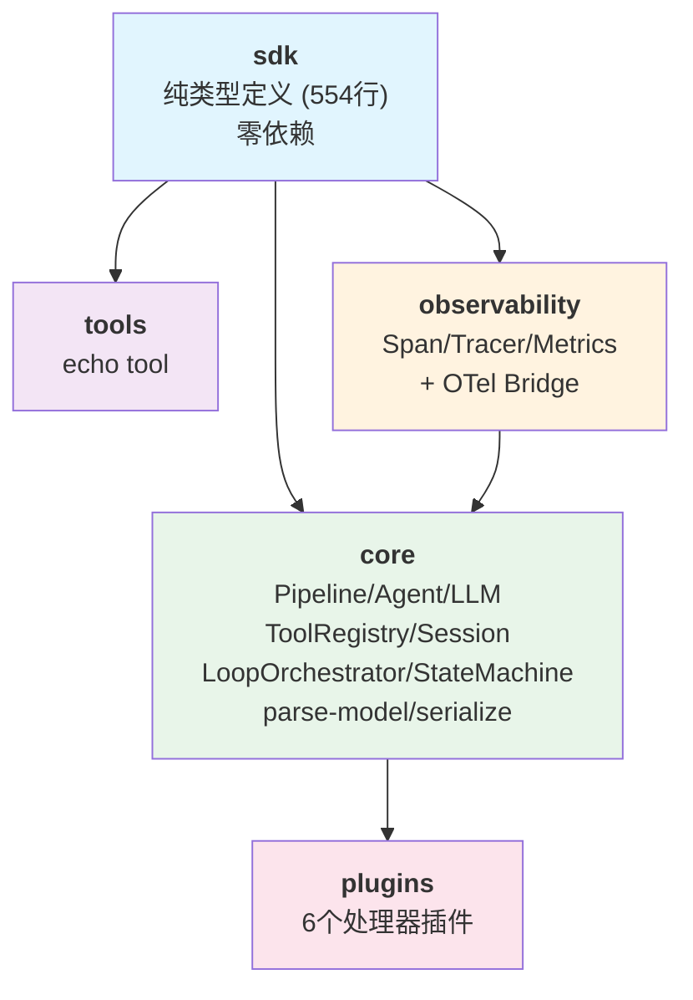

## 2. Pipeline 生命周期 & Agentic Loop

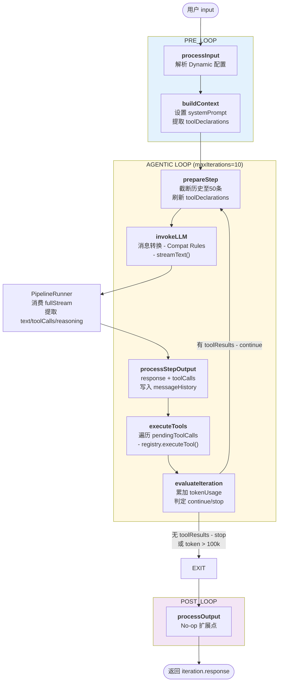

## 3. PipelineContext 四区域结构

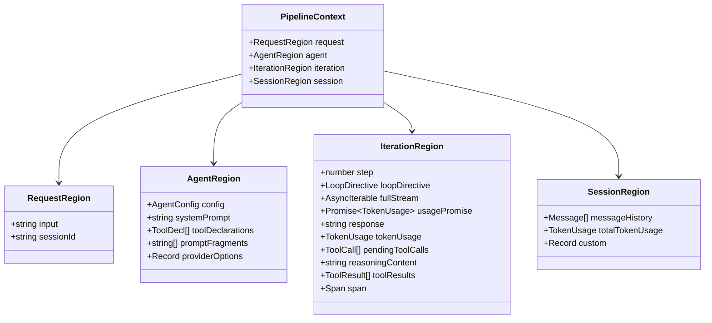

## 4. Model 解析 — Gateway Chain

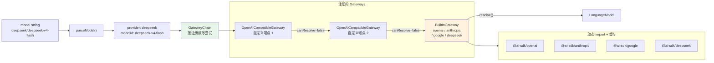

## 5. Provider 兼容系统 — 双层机制

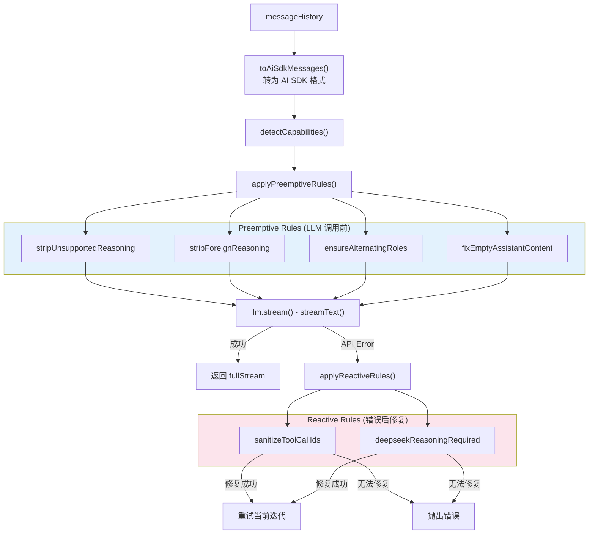

## 6. Agent 类组合关系

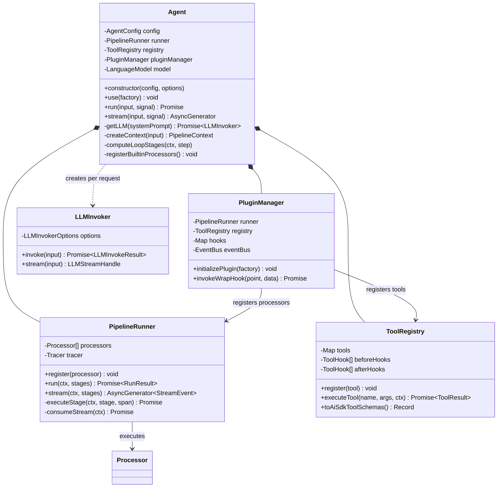

## 7. Session 持久化三层架构

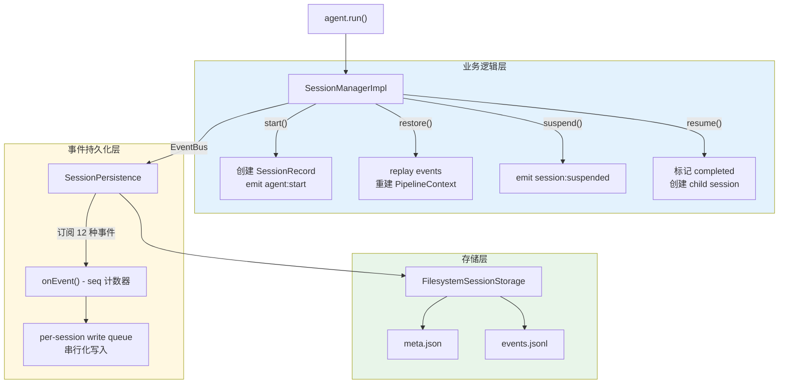

## 8. Plugin 系统注册流程

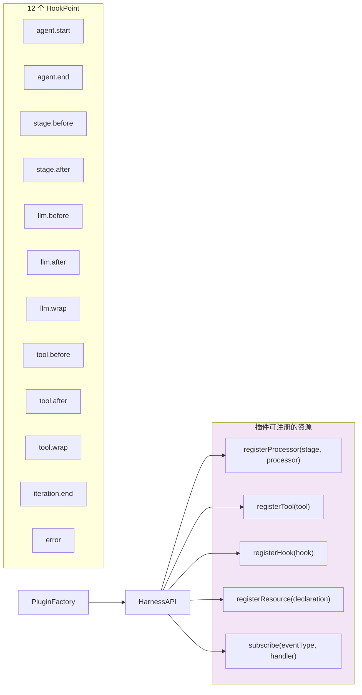

## 9. 6 个内置 Plugin 的阶段分布

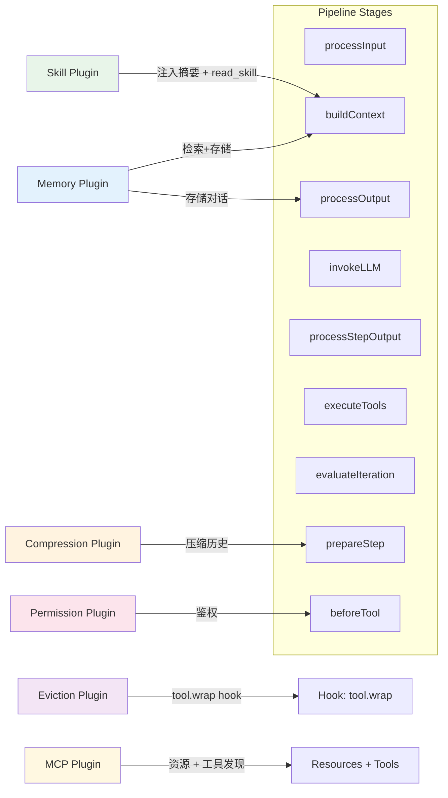

## 10. 工具执行生命周期

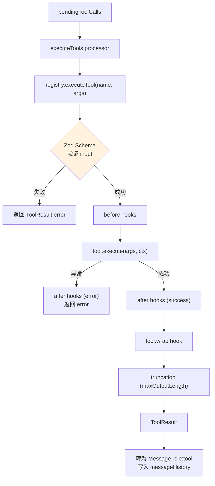

## 11. 运行时安全 — 并发 + Fallback + 异步任务

```mermaid
flowchart TD
    subgraph CONCURRENCY["ConcurrencyController"]
        CS["ConcurrencySlot"] --> ACQ["acquire(key)"]
        ACQ -->|"current 小于 max"| GRANT["授予 current++"]
        ACQ -->|"current 大于等于 max"| WAIT["waiter 队列"]
        GRANT --> RELEASE["release() current--<br/>唤醒下一个"]
    end

    subgraph FALLBACK["FallbackRunner"]
        FE["FallbackEntry[] 按优先级排序"]
        FE --> TRY1["尝试 priority=0"]
        TRY1 -->|"成功"| OK["返回"]
        TRY1 -->|"失败"| EMIT["emit task:fallback"]
        EMIT --> TRY2["尝试 priority=1"]
        TRY2 -->|"全部失败"| THROW2["抛出错误"]
    end

    subgraph ASYNC_TASKS["TaskManagerImpl"]
        LAUNCH["launch(config, prompt)"]
        LAUNCH --> SLOT{"需要并发控制?"}
        SLOT -->|"是"| ACQUIRE2["acquire slot"]
        SLOT -->|"否"| RUN
        ACQUIRE2 --> RUN["fire-and-forget"]
        RUN --> AGENT2["Agent.run(signal)"]
        AGENT2 -->|"成功"| COMPLETE["status=completed"]
        AGENT2 -->|"失败"| FAIL["status=failed"]
        RUN -->|"cancel()"| CANCEL["AbortController.abort()"]
    end

    style CONCURRENCY fill:#e3f2fd
    style FALLBACK fill:#fff3e0
    style ASYNC_TASKS fill:#e8f5e9
```

## 12. 配置多层合并

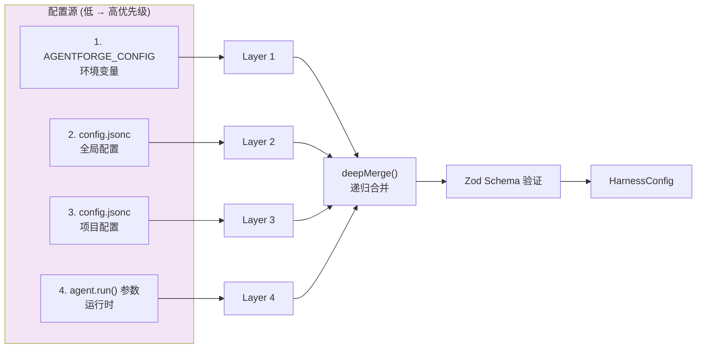

## 13. LoopOrchestrator + StateMachine 状态流转

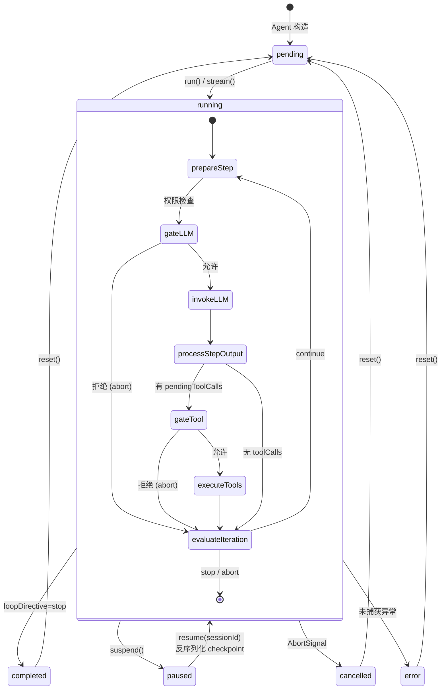
