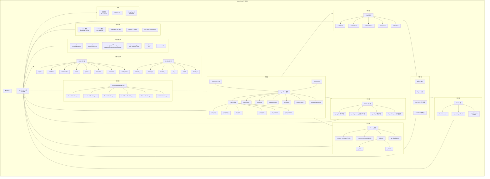

# AgentScope 完整架构图（增强版）

```mermaid
graph TB
    subgraph "AgentScope 整体架构"
        Client["用户应用"]
        Init["agentscope.init()<br/>全局配置"]

        subgraph "观测层"
            Tracing["tracing 包"]
            OTel["OpenTelemetry"]
            Studio["AgentScope Studio"]
            ThirdParty["Arize-Phoenix<br/>Langfuse"]

            Tracing --> OTel
            Tracing --> Studio
            Tracing --> ThirdParty
        end

        subgraph "编排层"
            Pipeline["Pipeline 类"]
            Functional["函数式编程"]
            MsgHub["MsgHub 消息集线器"]
            ChatRoom["ChatRoom 聊天室"]

            Pipeline <--> MsgHub
            Functional --> Pipeline
            MsgHub --> ChatRoom
        end

        subgraph "消息层"
            Msg["Msg 消息类"]
            AudioBlock["AudioBlock"]
            ToolUseBlock["ToolUseBlock"]
            ToolResultBlock["ToolResultBlock"]
            ImageBlock["ImageBlock"]
            VideoBlock["VideoBlock"]

            Msg --> AudioBlock
            Msg --> ToolUseBlock
            Msg --> ToolResultBlock
            Msg --> ImageBlock
            Msg --> VideoBlock
        end

        subgraph "工具层"
            Toolkit["Toolkit 工具包"]
            TextFile["_text_file 文本工具"]
            MultiModality["_multi_modality 多模态工具"]
            Coding["_coding 编程工具"]
            AsyncWrapper["AsyncWrapper 异步包装器"]

            Toolkit --> TextFile
            Toolkit --> MultiModality
            Toolkit --> Coding
            Toolkit --> AsyncWrapper
        end

        subgraph "记忆层"
            Memory["Memory 系统"]
            WorkingMemory["_working_memory 工作记忆"]
            InMemory["InMemoryMemory 短期记忆"]
            LongTerm["长期记忆"]
            Reme["_reme"]
            Mem0["_mem0"]
            RAG["rag 检索增强生成"]

            Memory --> WorkingMemory
            Memory --> InMemory
            Memory --> LongTerm
            LongTerm --> Reme
            LongTerm --> Mem0
            Memory --> RAG
        end

        subgraph "代理层"
            AgentMeta["_AgentMeta 元类"]
            StateModule["StateModule"]
            AgentBase["AgentBase 基类"]

            Hooks["6种钩子系统"]
            PreReply["pre_reply"]
            PostReply["post_reply"]
            PrePrint["pre_print"]
            PostPrint["post_print"]
            PreObserve["pre_observe"]
            PostObserve["post_observe"]

            ReActAgent["ReActAgent"]
            UserAgent["UserAgent"]
            RealtimeAgent["RealtimeAgent"]
            A2AAgent["A2AAgent"]
            BrowserAgent["BrowserAgent"]
            DeepResearchAgent["DeepResearchAgent"]

            AgentMeta --> AgentBase
            StateModule --> AgentBase
            AgentBase --> Hooks
            Hooks --> PreReply
            Hooks --> PostReply
            Hooks --> PrePrint
            Hooks --> PostPrint
            Hooks --> PreObserve
            Hooks --> PostObserve

            AgentBase --> ReActAgent
            AgentBase --> UserAgent
            AgentBase --> RealtimeAgent
            AgentBase --> A2AAgent
            AgentBase --> BrowserAgent
            AgentBase --> DeepResearchAgent
        end

        subgraph "模型层"
            ChatModelBase["ChatModelBase 抽象基类"]
            OpenAI["OpenAIChatWrapper"]
            Anthropic["AnthropicChatWrapper"]
            Gemini["GeminiChatWrapper"]
            DashScope["DashScopeChatWrapper"]
            Ollama["OllamaChatWrapper"]
            Trinity["TrinityChatWrapper"]

            ChatModelBase --> OpenAI
            ChatModelBase --> Anthropic
            ChatModelBase --> Gemini
            ChatModelBase --> DashScope
            ChatModelBase --> Ollama
            ChatModelBase --> Trinity
        end

        subgraph "特色功能"
            Tuner["tuner 模块<br/>提示调优/模型选择"]
            Evaluate["evaluate 模块<br/>ACE 基准测试"]
            Embedding["embedding 嵌入模型"]
            RealtimeModule["realtime 实时通信"]
            A2AModule["a2a Agent-to-Agent协议"]
        end

        subgraph "可选依赖组"
            DepsA2A["a2a<br/>nacos-sdk-python"]
            DepsRealtime["realtime<br/>websockets, scipy"]
            DepsRAG["rag<br/>text/pdf/docx/excel/ppt<br/>qdrant/milvus/mongodb/oceanbase"]
            DepsTuner["tuner/tuner-gpu<br/>dspy, datasets, litellm"]
            DepsEvaluate["evaluate<br/>ray"]
            DepsMCP["mcp&gt;=1.13"]
        end

        subgraph "示例与测试"
            Examples["8大示例分类"]
            ExamplesAgent["agent/"]
            ExamplesWorkflow["workflows/"]
            ExamplesFunc["functionality/"]
            ExamplesTuner["tuner/"]
            ExamplesGame["game/"]
            ExamplesInt["integration/"]
            ExamplesEval["evaluation/"]
            ExamplesDeploy["deployment/"]

            Tests["50+ 测试文件"]
            TestsFormatter["formatter_*"]
            TestsMemory["memory_*"]
            TestsRealtime["realtime_*"]
            TestsRAG["rag_*"]
            TestsTool["tool_*"]
            TestsTracing["tracing_*"]
        end

        subgraph "文档"
            DocsTutorial["双语教程<br/>zh_CN / en"]
            DocsRoadmap["roadmap.md"]
            DocsChangelog["changelog.md<br/>NEWS.md"]
        end
    end

    Client --> Init
    Init --> 观测层
    Init --> 编排层
    Init --> 消息层
    Init --> 工具层
    Init --> 记忆层
    Init --> 代理层
    Init --> 模型层
    Init --> 特色功能

    模型层 --> 代理层
    代理层 --> 记忆层
    代理层 --> 工具层
    代理层 --> 消息层
    消息层 --> 编排层
    编排层 --> 观测层

    Init --> 可选依赖组
    Init --> 示例与测试
    Init --> 文档

    Examples --> ExamplesAgent
    Examples --> ExamplesWorkflow
    Examples --> ExamplesFunc
    Examples --> ExamplesTuner
    Examples --> ExamplesGame
    Examples --> ExamplesInt
    Examples --> ExamplesEval
    Examples --> ExamplesDeploy

    Tests --> TestsFormatter
    Tests --> TestsMemory
    Tests --> TestsRealtime
    Tests --> TestsRAG
    Tests --> TestsTool
    Tests --> TestsTracing
```

---

## 版本要求

- **Python**: ≥3.10
- **许可证**: Apache-2.0
