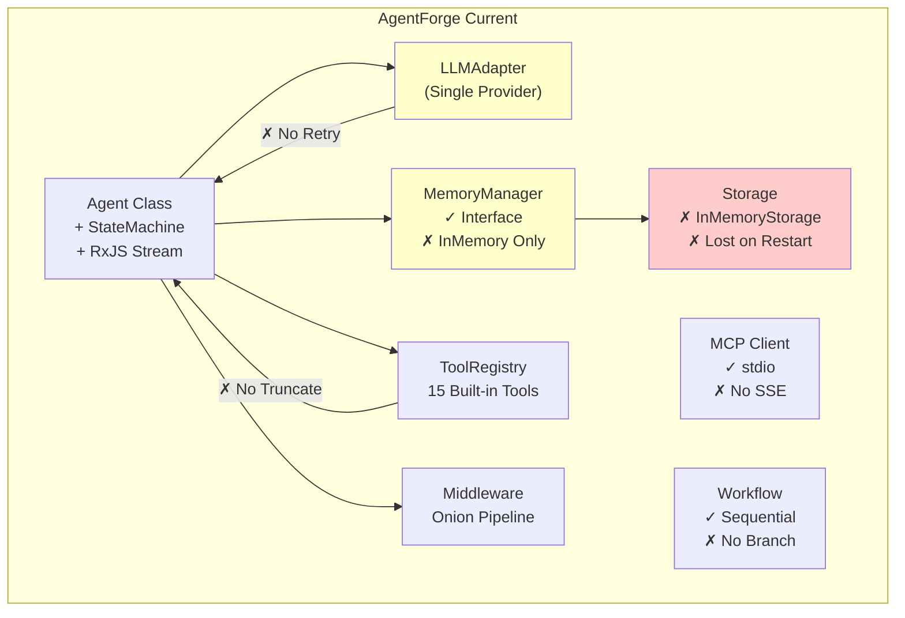
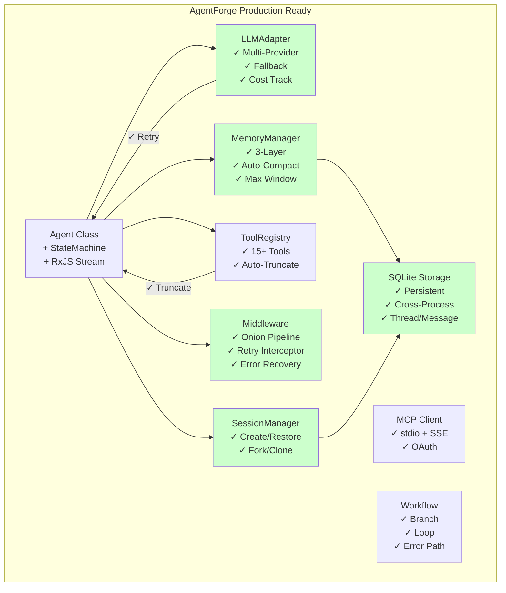
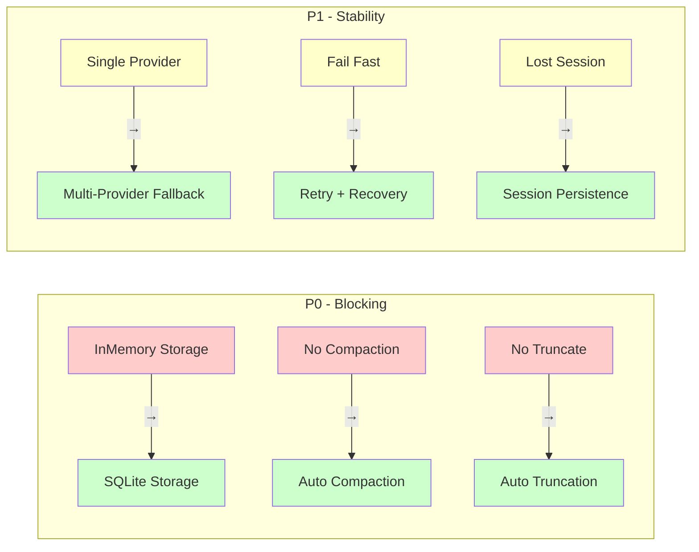

# AgentForge 架构图

> 生成日期：2025-04-24

---

## As-Is（现状架构）

```
┌─────────────────────────────────────────────────────────────────┐
│                        AgentForge Current                        │
├─────────────────────────────────────────────────────────────────┤
│                                                                   │
│  ┌──────────────────────────────────────────────────────────┐  │
│  │                     Agent (Class)                          │  │
│  │  ┌─────────────┐  ┌─────────────┐  ┌─────────────┐        │  │
│  │  │ StateMachine│  │ History    │  │ Registry   │        │  │
│  │  │ (RxJS)      │  │ (InMemory) │  │ (15 Tools) │        │  │
│  │  └─────────────┘  └─────────────┘  └─────────────┘        │  │
│  │         │              │               │                  │  │
│  │         └──────────────┼───────────────┘                  │  │
│  │                        ▼                                   │  │
│  │              ┌─────────────────┐                         │  │
│  │              │ runStream()      │                         │  │
│  │              │ Observable<Event>│                         │  │
│  │              └─────────────────┘                         │  │
│  └──────────────────────────────────────────────────────────┘  │
│                                                                   │
│  ┌──────────────────┐  ┌──────────────────┐                   │
│  │   LLMAdapter     │  │   Middleware     │                   │
│  │   (Vercel AI)    │  │   Pipeline       │                   │
│  │   ✓ 单一 Provider │  │   ✓ Onion-style  │                   │
│  └──────────────────┘  └──────────────────┘                   │
│                                                                   │
│  ┌──────────────────┐  ┌──────────────────┐                   │
│  │   MemoryManager  │  │   Permission     │                   │
│  │   ✓ 接口设计     │  │   ✓ Pattern-based│                   │
│  │   ✗ 仅 InMemory  │  │   ✗ 无持久化     │                   │
│  └──────────────────┘  └──────────────────┘                   │
│                                                                   │
│  ┌──────────────────┐  ┌──────────────────┐                   │
│  │   MCP Client     │  │   Workflow       │                   │
│  │   ✓ stdio        │  │   ✓ 基础编排     │                   │
│  │   ✗ 无 SSE       │  │   ✗ 无分支       │                   │
│  └──────────────────┘  └──────────────────┘                   │
│                                                                   │
│  ┌──────────────────────────────────────────────────────────┐  │
│  │                    Storage Layer                          │  │
│  │  ┌─────────────────┐                                      │  │
│  │  │ InMemoryStorage │  ← ★ 问题：重启丢数据                 │  │
│  │  │ ✗ 无持久化      │                                      │  │
│  │  └─────────────────┘                                      │  │
│  └──────────────────────────────────────────────────────────┘  │
│                                                                   │
│  ┌──────────────────────────────────────────────────────────┐  │
│  │                    缺失能力                               │  │
│  │  ✗ 记忆压缩（上下文溢出）                                  │  │
│  │  ✗ 输出截断（大输出崩溃）                                  │  │
│  │  ✗ 错误重试（网络抖动失败）                                │  │
│  │  ✗ 模型降级（单点故障）                                    │  │
│  │  ✗ Session 恢复（关闭丢状态）                              │  │
│  └──────────────────────────────────────────────────────────┘  │
│                                                                   │
└─────────────────────────────────────────────────────────────────┘
```

---

## To-Be（目标架构）

```
┌─────────────────────────────────────────────────────────────────┐
│                     AgentForge Production Ready                   │
├─────────────────────────────────────────────────────────────────┤
│                                                                   │
│  ┌──────────────────────────────────────────────────────────┐  │
│  │                     Agent (Class)                          │  │
│  │  ┌─────────────┐  ┌─────────────┐  ┌─────────────┐        │  │
│  │  │ StateMachine│  │ Memory     │  │ Registry   │        │  │
│  │  │ (RxJS)      │  │ Manager   │  │ (15+ Tools) │        │  │
│  │  │ ✓ 暂停/恢复 │  │ ✓ 智能    │  │ ✓ 自动截断 │        │  │
│  │  └─────────────┘  └─────────────┘  └─────────────┘        │  │
│  │         │              │               │                  │  │
│  │         └──────────────┼───────────────┘                  │  │
│  │                        ▼                                   │  │
│  │              ┌─────────────────┐                         │  │
│  │              │ runStream()      │                         │  │
│  │              │ Observable<Event>│                         │  │
│  │              └─────────────────┘                         │  │
│  └──────────────────────────────────────────────────────────┘  │
│                                                                   │
│  ┌──────────────────────┐  ┌──────────────────────┐           │
│  │     LLMAdapter       │  │     Middleware       │           │
│  │     (Multi-Provider) │  │     Pipeline         │           │
│  │     ✓ 主备切换       │  │     ✓ Onion-style    │           │
│  │     ✓ 降级策略       │  │     ✓ 重试拦截        │           │
│  │     ✓ 成本追踪       │  │     ✓ 错误恢复        │           │
│  └──────────────────────┘  └──────────────────────┘           │
│                                                                   │
│  ┌──────────────────────┐  ┌──────────────────────┐           │
│  │     MemoryManager    │  │     Permission       │           │
│  │     ✓ 三层记忆       │  │     ✓ Ruleset-based  │           │
│  │     ✓ 自动压缩       │  │     ✓ 持久化规则      │           │
│  │     ✓ Max Wind.      │  │     ✓ Deferred await│           │
│  └──────────────────────┘  └──────────────────────┘           │
│                                                                   │
│  ┌──────────────────────┐  ┌──────────────────────┐           │
│  │     MCP Client       │  │     Workflow         │           │
│  │     ✓ stdio          │  │     ✓ 条件分支       │           │
│  │     ✓ SSE transport  │  │     ✓ 循环           │           │
│  │     ✓ OAuth          │  │     ✓ 错误分支       │           │
│  └──────────────────────┘  └──────────────────────┘           │
│                                                                   │
│  ┌──────────────────────────────────────────────────────────┐  │
│  │                    Storage Layer                          │  │
│  │  ┌─────────────────┐  ┌─────────────────┐               │  │
│  │  │ SQLite Storage  │  │ InMemory Storage│               │  │
│  │  │ ★ 生产使用       │  │ (测试/临时)     │               │  │
│  │  │ ✓ 持久化        │  │                 │               │  │
│  │  │ ✓ 跨进程共享    │  │                 │               │  │
│  │  │ ✓ Thread/Message│  │                 │               │  │
│  │  └─────────────────┘  └─────────────────┘               │  │
│  └──────────────────────────────────────────────────────────┘  │
│                                                                   │
│  ┌──────────────────────────────────────────────────────────┐  │
│  │                    Session Layer                          │  │
│  │  ┌─────────────────────────────────────────────────┐    │  │
│  │  │ SessionManager                                    │    │  │
│  │  │ ✓ 创建/恢复/克隆                                  │    │  │
│  │  │ ✓ 状态持久化                                      │    │  │
│  │  │ ✓ Fork/Share                                      │    │  │
│  │  └─────────────────────────────────────────────────┘    │  │
│  └──────────────────────────────────────────────────────────┘  │
│                                                                   │
│  ┌──────────────────────────────────────────────────────────┐  │
│  │                    新增能力 (P0-P1)                       │  │
│  │  ✓ SQLite 持久化 → 数据不丢失                            │  │
│  │  ✓ 记忆压缩 → 长对话不崩溃                               │  │
│  │  ✓ 输出截断 → 大输出不溢出                               │  │
│  │  ✓ 错误重试 → 网络抖动容错                               │  │
│  │  ✓ 模型降级 → 单点故障恢复                               │  │
│  │  ✓ Session 恢复 → 关闭可续接                             │  │
│  └──────────────────────────────────────────────────────────┘  │
│                                                                   │
└─────────────────────────────────────────────────────────────────┘
```

---

## 差距对比

```
┌──────────────────────────────────────────────────────────────────┐
│                      As-Is → To-Be 变化                            │
├──────────────────────────────────────────────────────────────────┤
│                                                                    │
│  Storage Layer:                                                    │
│  ┌────────────────────┐      ┌────────────────────┐              │
│  │ InMemoryStorage    │  →   │ SQLite Storage     │  P0         │
│  │ ✗ 重启丢数据       │      │ ✓ 持久化           │              │
│  └────────────────────┘      └────────────────────┘              │
│                                                                    │
│  Memory Manager:                                                   │
│  ┌────────────────────┐      ┌────────────────────┐              │
│  │ MessageHistory      │  →   │ + Auto Compaction  │  P0         │
│  │ ✗ 无限增长          │      │ ✓ 超阈值压缩       │              │
│  └────────────────────┘      └────────────────────┘              │
│                                                                    │
│  Tool Execution:                                                   │
│  ┌────────────────────┐      ┌────────────────────┐              │
│  │ Direct Return      │  →   │ Auto Truncation    │  P0         │
│  │ ✗ 大输出溢出       │      │ ✓ 截断 + 文件路径  │              │
│  └────────────────────┘      └────────────────────┘              │
│                                                                    │
│  LLM Adapter:                                                      │
│  ┌────────────────────┐      ┌────────────────────┐              │
│  │ Single Provider     │  →   │ Multi-Provider     │  P1         │
│  │ ✗ 单点故障         │      │ ✓ 主备切换         │              │
│  └────────────────────┘      └────────────────────┘              │
│                                                                    │
│  Error Handling:                                                   │
│  ┌────────────────────┐      ┌────────────────────┐              │
│  │ Fail Fast          │  →   │ Retry + Recovery   │  P1         │
│  │ ✗ 立即失败         │      │ ✓ 重试 + 恢复      │              │
│  └────────────────────┘      └────────────────────┘              │
│                                                                    │
│  Permission:                                                       │
│  ┌────────────────────┐      ┌────────────────────┐              │
│  │ InMemory Rules     │  →   │ Persistent Rules    │  P2         │
│  │ ✗ 每次重新确认     │      │ ✓ 记住用户选择     │              │
│  └────────────────────┘      └────────────────────┘              │
│                                                                    │
│  Workflow:                                                         │
│  ┌────────────────────┐      ┌────────────────────┐              │
│  │ Sequential Only    │  →   │ Branch + Loop      │  P2         │
│  │ ✗ 仅顺序           │      │ ✓ 条件 + 循环      │              │
│  └────────────────────┘      └────────────────────┘              │
│                                                                    │
└──────────────────────────────────────────────────────────────────┘
```

---

## 数据流对比

### As-Is 数据流

```
User Input
    │
    ▼
┌─────────────┐
│   Agent     │
│ runStream() │
└──────┬──────┘
       │
       ▼
┌─────────────┐     ┌──────────────┐
│ LLMAdapter  │────▶│ InMemory     │
│ streamText()│     │ MessageHistory│
└──────┬──────┘     └──────────────┘
       │                   │
       ▼                   ▼
┌─────────────┐     ┌──────────────┐
│ ToolRegistry│     │ Lost on      │
│ execute()   │     │ Restart      │
└──────┬──────┘     └──────────────┘
       │                   ✗
       ▼
┌─────────────┐
│ Observable  │
│ <Event>     │
└─────────────┘
```

### To-Be 数据流

```
User Input
    │
    ▼
┌─────────────┐
│   Agent     │
│ runStream() │
└──────┬──────┘
       │
       ▼
┌─────────────┐     ┌──────────────┐
│ LLMAdapter  │────▶│ MemoryManager│
│ streamText()│     │ + Compaction │
└──────┬──────┘     └──────┬───────┘
       │                   │
       │            ┌──────┴───────┐
       │            ▼              ▼
       │     ┌────────────┐ ┌────────────┐
       │     │ SQLite     │ │ Working    │
       │     │ Storage    │ │ Memory     │
       │     └────────────┘ └────────────┘
       │            ✓ 持久化
       ▼
┌─────────────┐
│ ToolRegistry│
│ + Truncate  │
└──────┬──────┘
       │
       ▼
┌─────────────┐
│ Observable  │
│ <Event>     │
└─────────────┘
```

---

## Mermaid 版本（可渲染）

### As-Is 架构



### To-Be 架构



### P0-P1 变化对比



---

## 文件变更映射

| 层级 | 新增文件 | 修改文件 | 优先级 |
|------|---------|---------|--------|
| Storage | `src/memory/storages/sqlite.ts` | `src/memory/manager.ts` | P0 |
| Compaction | `src/memory/compaction.ts` | `src/memory/manager.ts` | P0 |
| Truncation | - | `src/agent/agent.ts` | P0 |
| Retry | `src/agent/retry.ts` | `src/agent/agent.ts` | P1 |
| Provider | `src/provider/resolver.ts` | `src/adapters/ai-adapter.ts` | P1 |
| Session | `src/session/recovery.ts` | `src/session/index.ts` | P1 |

---

## 变更记录

| 日期 | 变更 | 作者 |
|------|------|------|
| 2025-04-24 | 初始版本 | Sisyphus |

