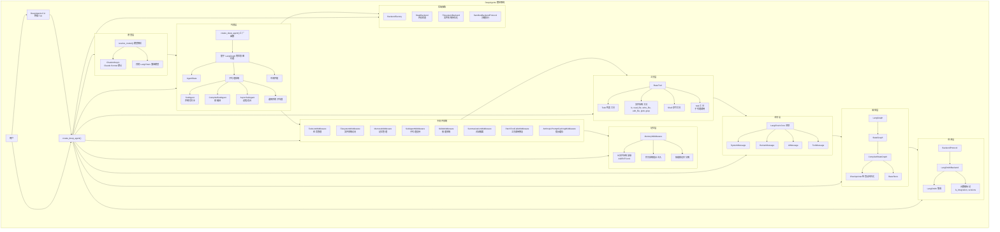

# DeepAgents 完整架构图

```mermaid
graph TB
    subgraph "DeepAgents 整体架构"
        User["用户"]
        CLI["DeepAgents CLI<br/>终端 TUI"]
        SDK["create_deep_agent()"]

        subgraph "观测层"
            LangSmith["LangSmith 集成"]
            BackendProtocol["BackendProtocol"]
            LangSmithBackend["LangSmithBackend"]
            Metadata["元数据标记<br/>ls_integration, versions"]

            BackendProtocol --> LangSmithBackend
            LangSmithBackend --> LangSmith
            LangSmithBackend --> Metadata
        end

        subgraph "编排层"
            LangGraph["LangGraph"]
            StateGraph["StateGraph"]
            CompiledGraph["CompiledStateGraph"]
            Checkpointer["Checkpointer 检查点持久化"]
            BaseStore["BaseStore"]

            LangGraph --> StateGraph
            StateGraph --> CompiledGraph
            CompiledGraph --> Checkpointer
            CompiledGraph --> BaseStore
        end

        subgraph "消息层"
            LangChainMsg["LangChain Core 消息"]
            SystemMessage["SystemMessage"]
            HumanMessage["HumanMessage"]
            AIMessage["AIMessage"]
            ToolMessage["ToolMessage"]

            LangChainMsg --> SystemMessage
            LangChainMsg --> HumanMessage
            LangChainMsg --> AIMessage
            LangChainMsg --> ToolMessage
        end

        subgraph "工具层"
            BaseTool["BaseTool"]
            TodoTools["Todo 列表工具"]
            FileTools["文件系统工具<br/>ls, read_file, write_file, edit_file, glob, grep"]
            ShellTools["Shell 命令工具"]
            TaskTool["task 工具<br/>子代理调用"]

            BaseTool --> TodoTools
            BaseTool --> FileTools
            BaseTool --> ShellTools
            BaseTool --> TaskTool
        end

        subgraph "记忆层"
            MemoryMiddleware["MemoryMiddleware"]
            FileLoad["从文件系统加载<br/>AGENTS.md"]
            SystemPrompt["作为系统提示注入"]
            SkillsSeparate["技能和记忆分离"]

            MemoryMiddleware --> FileLoad
            MemoryMiddleware --> SystemPrompt
            MemoryMiddleware --> SkillsSeparate
        end

        subgraph "代理层"
            Factory["create_deep_agent() 工厂函数"]
            StateGraphAgent["基于 LangGraph 的状态图代理"]
            AgentState["AgentState"]

            SubAgents["子代理系统"]
            SubAgent["SubAgent<br/>声明式同步"]
            CompiledSubAgent["CompiledSubAgent<br/>预编译"]
            AsyncSubAgent["AsyncSubAgent<br/>远程/后台"]
            GeneralPurpose["通用目的子代理"]

            MiddlewareChain["中间件链"]

            Factory --> StateGraphAgent
            StateGraphAgent --> AgentState
            StateGraphAgent --> SubAgents
            StateGraphAgent --> MiddlewareChain

            SubAgents --> SubAgent
            SubAgents --> CompiledSubAgent
            SubAgents --> AsyncSubAgent
            SubAgents --> GeneralPurpose
        end

        subgraph "中间件系统"
            TodoListMiddleware["TodoListMiddleware<br/>任务管理"]
            FilesystemMiddleware["FilesystemMiddleware<br/>文件系统访问"]
            MemoryMiddleware2["MemoryMiddleware<br/>记忆管理"]
            SubAgentMiddleware["SubAgentMiddleware<br/>子代理支持"]
            SkillsMiddleware["SkillsMiddleware<br/>技能系统"]
            SummarizationMiddleware["SummarizationMiddleware<br/>对话摘要"]
            PatchToolCallsMiddleware["PatchToolCallsMiddleware<br/>工具调用修复"]
            AnthropicPromptCachingMiddleware["AnthropicPromptCachingMiddleware<br/>提示缓存"]
        end

        subgraph "模型层"
            ResolveModel["resolve_model() 模型解析"]
            ChatAnthropic["ChatAnthropic<br/>Claude Sonnet 默认"]
            LangChainModels["其他 LangChain 兼容模型"]

            ResolveModel --> ChatAnthropic
            ResolveModel --> LangChainModels
        end

        subgraph "后端抽象"
            BackendFactory["BackendFactory"]
            StateBackend["StateBackend<br/>内存状态"]
            FilesystemBackend["FilesystemBackend<br/>文件系统持久化"]
            SandboxBackend["SandboxBackendProtocol<br/>沙箱执行"]
        end
    end

    User --> CLI
    User --> SDK
    CLI --> SDK

    SDK --> 观测层
    SDK --> 编排层
    SDK --> 消息层
    SDK --> 工具层
    SDK --> 记忆层
    SDK --> 代理层
    SDK --> 中间件系统
    SDK --> 模型层
    SDK --> 后端抽象

    模型层 --> 代理层
    代理层 --> 中间件系统
    中间件系统 --> 记忆层
    中间件系统 --> 工具层
    工具层 --> 消息层
    消息层 --> 编排层
    编排层 --> 观测层

    代理层 --> 后端抽象
```
