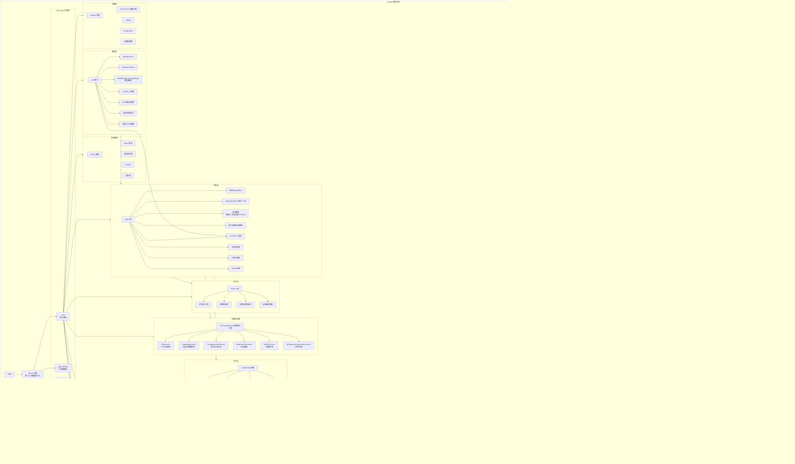

# Mastra 完整架构图

```mermaid
graph TB
    subgraph "Mastra 整体架构"
        App["应用"]
        MastraInstance["Mastra 实例<br/>统一入口和配置中心"]

        subgraph "观测层"
            Observability["observability 包"]
            Spans["跨度管理<br/>getOrCreateSpan"]
            EntityTypes["实体类型分类"]
            SpanTypes["跨度类型分类"]
            ObservabilityContext["观测上下文"]
            Exporters["可插拔导出器"]
            DefaultExporter["DefaultExporter"]
            CloudExporter["CloudExporter"]
            SensitiveFilter["敏感数据过滤器"]

            Observability --> Spans
            Observability --> EntityTypes
            Observability --> SpanTypes
            Observability --> ObservabilityContext
            Observability --> Exporters
            Exporters --> DefaultExporter
            Exporters --> CloudExporter
            Observability --> SensitiveFilter
        end

        subgraph "编排层"
            Workflow["Workflow 工作流"]
            Step["Step 步骤"]
            ChainAPI["链式 API<br/>.then(), .branch(), .parallel()"]
            BranchMapping["分支映射"]
            ExecutionEngine["执行引擎"]
            DefaultEngine["默认引擎"]
            InngestEngine["Inngest 引擎"]
            WorkflowEvents["工作流事件处理器"]
            WorkflowRuns["工作流运行管理"]
            EventDriven["事件驱动执行"]

            Workflow --> Step
            Workflow --> ChainAPI
            Workflow --> BranchMapping
            Workflow --> ExecutionEngine
            ExecutionEngine --> DefaultEngine
            ExecutionEngine --> InngestEngine
            Workflow --> WorkflowEvents
            Workflow --> WorkflowRuns
            Workflow --> EventDriven
        end

        subgraph "消息层"
            MessageList["MessageList 消息列表"]
            UIMessage["UIMessage"]
            MastraDBMessage["MastraDBMessage"]
            UIMessageWithMetadata["UIMessageWithMetadata"]
            SaveQueue["SaveQueueManager<br/>保存队列管理器"]
            MessageMetadata["消息元数据"]
            DatabasePersistence["数据库持久化"]

            MessageList --> UIMessage
            MessageList --> MastraDBMessage
            MessageList --> UIMessageWithMetadata
            MessageList --> SaveQueue
            MessageList --> MessageMetadata
            MessageList --> DatabasePersistence
        end

        subgraph "工具层"
            CreateTool["createTool() 函数"]
            CoreTool["CoreTool"]
            ZodValidation["Zod 模式验证"]
            StreamingTools["流式工具"]
            CoreToolAdapter["核心工具适配器"]
            DynamicTools["动态工具解析<br/>基于请求上下文"]
            VercelIntegration["Vercel 工具集成"]
            AISDKTools["AI SDK 工具兼容"]

            CreateTool --> CoreTool
            CoreTool --> ZodValidation
            CoreTool --> StreamingTools
            CoreTool --> CoreToolAdapter
            CreateTool --> DynamicTools
            CreateTool --> VercelIntegration
            CreateTool --> AISDKTools
        end

        subgraph "记忆层"
            Memory["Memory 类"]
            WorkingMemory["工作记忆支持"]
            ProcessorCache["处理器缓存"]
            MemoryConfigInternal["记忆配置内部化"]
            DynamicConfig["动态配置解析"]

            Memory --> WorkingMemory
            Memory --> ProcessorCache
            Memory --> MemoryConfigInternal
            Memory --> DynamicConfig
        end

        subgraph "代理层"
            Agent["Agent 类"]
            MastraBase["继承 MastraBase"]
            RequestContext["RequestContext 请求上下文"]
            DynamicConfigAgent["动态配置<br/>模型/工具/指令基于上下文"]
            Processors["输入/输出处理器链"]
            AISDKv6["AI SDK v6 ToolLoopAgent 兼容"]
            Scorers["评分器集成"]
            WorkspaceInheritance["工作区继承"]
            HooksAgent["hooks 系统"]

            Agent --> MastraBase
            Agent --> RequestContext
            Agent --> DynamicConfigAgent
            Agent --> Processors
            Agent --> AISDKv6
            Agent --> Scorers
            Agent --> WorkspaceInheritance
            Agent --> HooksAgent
        end

        subgraph "处理器系统"
            ProcessorsRunner["ProcessorRunner 处理器运行器"]
            PIIDetector["PIIDetector<br/>个人信息检测"]
            LanguageDetector["LanguageDetector<br/>语言检测和翻译"]
            PromptInjectionDetector["PromptInjectionDetector<br/>提示注入检测"]
            ModerationProcessor["ModerationProcessor<br/>内容审核"]
            SkillsProcessor["SkillsProcessor<br/>技能处理"]
            WorkspaceInstructionsProcessor["WorkspaceInstructionsProcessor<br/>工作区指令"]

            ProcessorsRunner --> PIIDetector
            ProcessorsRunner --> LanguageDetector
            ProcessorsRunner --> PromptInjectionDetector
            ProcessorsRunner --> ModerationProcessor
            ProcessorsRunner --> SkillsProcessor
            ProcessorsRunner --> WorkspaceInstructionsProcessor
        end

        subgraph "模型层"
            LLMGateway["LLM 网关"]
            MastraLLMV1["MastraLLMV1"]
            MastraLLMVNext["MastraLLMVNext"]
            ModelRouter["ModelRouterLanguageModel<br/>模型路由"]
            AISDKv4["AI SDK v4 集成"]
            AISDKv6["AI SDK v6 集成"]
            ModelProviders["40+ 模型提供商"]
            DynamicModelConfig["动态模型配置"]
            RequestContextAware["请求上下文感知"]

            LLMGateway --> MastraLLMV1
            LLMGateway --> MastraLLMVNext
            LLMGateway --> ModelRouter
            LLMGateway --> AISDKv4
            LLMGateway --> AISDKv6
            LLMGateway --> ModelProviders
            LLMGateway --> DynamicModelConfig
            LLMGateway --> RequestContextAware
        end

        subgraph "Monorepo 包结构"
            CorePkg["core<br/>核心框架"]
            AgentBuilder["agent-builder<br/>代理构建器"]
            CLIPkg["cli<br/>命令行工具"]
            ServerPkg["server<br/>服务器"]
            MCPPkg["mcp<br/>MCP 支持"]
            PlaygroundPkg["playground<br/>游乐场 UI"]
            EvalsPkg["evals<br/>评估系统"]
            PartnersPkg["partners<br/>合作伙伴集成"]
        end

        subgraph "部署选项"
            NextJS["Next.js 集成"]
            React["React 集成"]
            Standalone["独立服务器"]
            NodeJS["Node.js"]
            Browser["浏览器"]
        end

        subgraph "存储层"
            Storage["Storage 存储"]
            VectorStore["Vector Store 向量存储"]
            LibSQL["LibSQL"]
            PostgreSQL["PostgreSQL"]
            OtherDB["其他数据库"]
        end
    end

    App --> MastraInstance
    MastraInstance --> CorePkg
    CorePkg --> 观测层
    CorePkg --> 编排层
    CorePkg --> 消息层
    CorePkg --> 工具层
    CorePkg --> 记忆层
    CorePkg --> 代理层
    CorePkg --> 处理器系统
    CorePkg --> 模型层
    CorePkg --> 存储层

    模型层 --> 代理层
    代理层 --> 处理器系统
    代理层 --> 记忆层
    代理层 --> 工具层
    工具层 --> 消息层
    消息层 --> 编排层
    编排层 --> 观测层

    MastraInstance --> AgentBuilder
    MastraInstance --> CLIPkg
    MastraInstance --> ServerPkg
    MastraInstance --> MCPPkg
    MastraInstance --> PlaygroundPkg
    MastraInstance --> EvalsPkg
    MastraInstance --> PartnersPkg

    CorePkg --> 部署选项
    部署选项 --> NextJS
    部署选项 --> React
    部署选项 --> Standalone
    部署选项 --> NodeJS
    部署选项 --> Browser

    存储层 --> VectorStore
    存储层 --> LibSQL
    存储层 --> PostgreSQL
```
