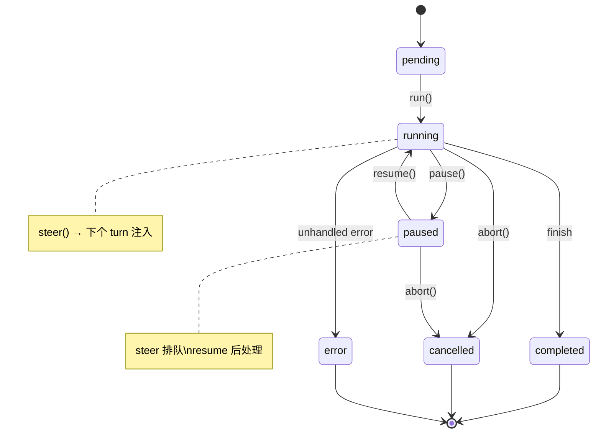
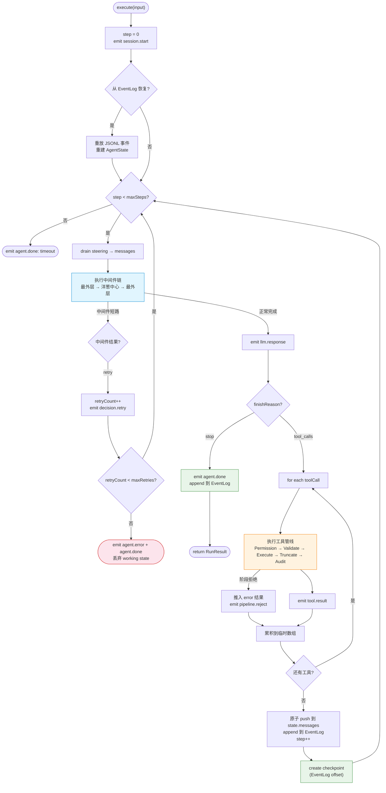

# AgentForge v2 — 架构设计

> 2026-05-08 | 综合 7 个同行项目分析 + Anthropic/LangChain/Mastra/crewAI 等评估方法论
>
> **权威性说明：** 本文档是 AgentForge v2 的唯一权威架构规范。以下同日标注的文档为早期探索草案，已被本文档取代：
> - `agentforge-architecture-v2.md` — 15 方法 AgentHook，已统一为中间件链
> - `phase-pipeline-spec.md` — BackendProtocol 抽象，已拆分为 FileSystem + CommandExecutor
> - `di-architecture.md` — 已整合入本文档
> - `evaluation-integration.md` — 评估系统设计已纳入第八节
>
> 上述文档与本文件的矛盾点以本文件为准。

## 目录

- [一、设计约束与核心目标](#一设计约束与核心目标)
- [二、分层架构](#二分层架构)
- [三、Layer 0：合约接口](#三layer-0合约接口)
- [四、Layer 1：Core 实现](#四layer-1core-实现)
- [五、Layer 2：内置中间件](#五layer-2内置中间件)
- [六、Layer 3：Adapter 实现](#六layer-3adapter-实现)
- [七、Layer 4：组合根 + 公共 API](#七layer-4组合根--公共-api)
- [八、可观测性：三层嵌入](#八可观测性三层嵌入)
- [九、评估系统](#九评估系统)
- [十、Plugin 模型](#十plugin-模型)
- [十一、包结构](#十一包结构)
- [十二、实施路径](#十二实施路径)
- [十三、与当前 AgentForge v1 的映射](#十三与当前-agentforge-v1-的映射)

---

## 一、设计约束与核心目标

### 四大支柱

| 支柱 | 含义 | 架构体现 |
|------|------|---------|
| **全透明** | Agent 的每一个决策、每一次状态变更都可见 | EventStream 是 Loop 的唯一输出；JSONL 不可变审计日志 |
| **全可观测** | Tracing、Metrics、Events 三种视角看同一份数据 | 事件驱动 Span 自动派生 + Metrics 自动聚合 |
| **全可插拔** | 在全链路注入逻辑，从开箱即用到完全自定义 | 中间件链 (onion) + 工具执行管线 (pipeline stages) |
| **全可中断/审核/重试/恢复** | Agent 可以在任何关键点位暂停、审核、回退、续接 | Checkpoint = 事件日志位置 + 审核模式 + 中间件级 retry |

### 评估闭环

> 通过评估来发现 Agent 的问题，基于评估结果改进 Agent 的配置/中间件/工具。
> 借鉴 OpenHarness/Better-Harness 六步循环（收集→划分→基线→迭代→审核→部署）。

### 框架"刚好"原则

> 内核 = Loop + Middleware Chain + Tool Pipeline + EventLog。
> 安全、记忆、工作流、评估、MCP 全部作为中间件或插件存在。

### 验证分层 (Zod)

| 层级 | 范围 | 策略 | 示例 |
|------|------|------|------|
| **Tier 1** | 外部输入（LLM 响应、MCP 数据、用户输入） | `safeParse` + 优雅降级，**永不 crash** | 解析 LLM 返回的 toolCall |
| **Tier 2** | 系统边界（事件总线 `AgentEvent`） | Zod `parse`——格式错误是 bug，快速失败 | `AgentEvent` 判别联合 |
| **Tier 3** | 内部（Loop、Middleware 间传递） | 纯 TypeScript 类型，零运行时开销 | `ctx: MiddlewareContext` |

---

## 二、分层架构

```
┌──────────────────────────────────────────────────────────────────┐
│ Layer 0: Interfaces (零依赖，纯类型)                               │
│                                                                  │
│ Tracer / Span        — 可观测性合约（自动从事件派生）              │
│ Metrics              — 可观测性合约（自动从事件聚合）              │
│ FileSystem           — 文件系统合约                                │
│ CommandExecutor      — Shell 执行合约                              │
│ LLMProvider          — LLM 调用合约                               │
│ Agent                — Agent 公共接口                             │
│ Controls             — 控制原语合约（含审核）                      │
│ EventLog             — 追加不可变事件日志合约                      │
└────────────────────────────┬─────────────────────────────────────┘
                             ↑ 实现
┌────────────────────────────┴─────────────────────────────────────┐
│ Layer 1: Core (只依赖 Layer 0)                                    │
│                                                                  │
│ AgentLoopImpl        — while(true) + 中间件链 + 工具管线          │
│ AgentControlsImpl    — Controls + AuditController 实现            │
│ AgentState           — 状态 + StateMachine                        │
│ EventStreamImpl      — push/pull 桥接实现                         │
│ EventLogImpl         — JSONL 追加不可变日志                        │
└────────────────────────────┬─────────────────────────────────────┘
                             ↑ 实现
┌────────────────────────────┴─────────────────────────────────────┐
│ Layer 2: Middleware (纯函数，依赖通过闭包/参数注入)                 │
│                                                                  │
│ memoryMw, skillsMw, workingMemMw, compactionMw                    │
│ permissionMw, rateLimitMw, qualityGateMw, auditMw                 │
└────────────────────────────┬─────────────────────────────────────┘
                             ↑ 实现
┌────────────────────────────┴─────────────────────────────────────┐
│ Layer 3: Adapters (实现 Layer 0 接口，隔离外部依赖)               │
│                                                                  │
│ OTelTracer / LangfuseTracer / NoopTracer                          │
│ OTelMetrics / NoopMetrics                                        │
│ NodeFileSystem / InMemoryFileSystem / SandboxFileSystem           │
│ AnthropicAdapter / OpenAIAdapter / GoogleAdapter / OllamaAdapter  │
└────────────────────────────┬─────────────────────────────────────┘
                             ↑ 装配
┌────────────────────────────┴─────────────────────────────────────┐
│ Layer 4: Composition Root                                         │
│                                                                  │
│ createAgent(config) — 唯一的 new 聚集地                           │
│ AgentBuilder       — 流畅 API，底层调 createAgent                 │
│ evaluate(task)     — 评估入口                                     │
└──────────────────────────────────────────────────────────────────┘
```

---

## 三、Layer 0：合约接口

> **命名空间约定：** Layer-0 接口放在 `src/interfaces/`（新目录）。现有的 `src/contracts/` 保留给 Tier-1 Zod 验证 schema（`llm-contract.ts`、`user-input-contract.ts` 等），两者目的不同，不混合。

### 3.1 Tracer

```typescript
// src/interfaces/tracer.ts

interface Tracer {
  startSpan(name: string, options?: {
    attributes?: Record<string, unknown>;
    parentSpanId?: string;
  }): Span;
}

interface Span {
  readonly id: string;
  setAttribute(key: string, value: unknown): void;
  addEvent(name: string, attrs?: Record<string, unknown>): void;
  recordException(error: Error): void;
  end(): void;
}
```

Span 不由用户手动管理。内核在 emit 事件时自动创建和关闭对应的 Span（见第八节）。

### 3.2 Metrics

```typescript
// src/interfaces/metrics.ts

interface Metrics {
  counter(name: string, value?: number, tags?: Record<string, string>): void;
  histogram(name: string, value: number, tags?: Record<string, string>): void;
  gauge(name: string, value: number, tags?: Record<string, string>): void;
}
```

Metrics 自动从 `AgentEvent` 聚合（见第八节）。内核强制执行以下指标：

| 触发事件 | 类型 | 指标名 | 标签 |
|---------|------|--------|------|
| `llm.response` | histogram | `turn.duration.ms` | — |
| `llm.response` | histogram | `turn.tokens` | `direction: input \| output` |
| `llm.response` | histogram | `llm.cost` | — |
| `llm.chunk` | histogram | `llm.chunk.latency` | — |
| `tool.result` | histogram | `tool.duration.ms` | `tool` |
| `tool.result` | counter | `tool.success` / `tool.failure` | `tool` |
| `tool.permission_denied` | counter | `tool.denied` | `tool`, `rule` |
| `hook.execute` | histogram | `hook.duration.ms` | `hook`, `phase` |
| `hook.error` | counter | `hook.error.count` | `hook`, `phase` |
| `decision.retry` | counter | `agent.retry` | `reason` |
| `agent.error` | counter | `agent.error` | `errorType` |
| `agent.done` | histogram | `agent.steps` | — |
| `agent.done` | counter | `agent.completed` | `status` |

注意：`NoopMetrics` 存在且为默认值。"强制执行"意味着 Loop 总是调用接口方法，而非必须连接真实后端。

### 3.3 FileSystem & CommandExecutor

```typescript
// src/interfaces/filesystem.ts

interface FileSystem {
  readFile(path: string, signal?: AbortSignal): Promise<string>;
  writeFile(path: string, content: string, signal?: AbortSignal): Promise<void>;
  deleteFile(path: string, signal?: AbortSignal): Promise<void>;
  ls(path: string, signal?: AbortSignal): Promise<FileEntry[]>;
}

interface CommandExecutor {
  execute(command: string, options?: {
    cwd?: string; env?: Record<string, string>;
    timeout?: number; signal?: AbortSignal;
  }): Promise<{ stdout: string; stderr: string; exitCode: number }>;
}

interface FileEntry {
  name: string; path: string; isDirectory: boolean; size: number;
}
```

`FileSystem` 和 `CommandExecutor` 是两个独立接口。代码 Agent 注入两个；纯 API Agent 只注入 `CommandExecutor` 或都不注入。`glob`、`grep` 属于搜索工具，通过 ToolRegistry 注册，不放在文件系统抽象中。

**InMemoryFileSystem**（测试专用）提供 `reset()` 和 `snapshot()`：

```typescript
// 仅在测试/评估场景使用的扩展接口
interface InMemoryFileSystem extends FileSystem {
  reset(): void;
  snapshot(): FileSystemSnapshot;
  restore(snapshot: FileSystemSnapshot): void;
}

interface FileSystemSnapshot {
  files: Map<string, string>;  // path → content
}
```

`InMemoryFileSystem` 定义在 `src/interfaces/filesystem.ts`，实现在 `src/adapters/`。

### 3.4 EventLog — 追加不可变事件日志

```typescript
// src/interfaces/event-log.ts

interface EventLog {
  /** 追加一个事件行。永不修改已有行。 */
  append(event: AgentEvent): Promise<void>;

  /** 从指定位置开始重放事件。offset 为 undefined 则从头开始。 */
  replay(fromOffset?: number): AsyncGenerator<AgentEvent>;

  /** 返回当前写入位置（行号），作为 checkpoint 使用。 */
  currentOffset(): number;
}

interface Checkpoint {
  id: string;
  sessionId: string;
  logOffset: number;      // EventLog 中的行号
  timestamp: number;
  metadata: {
    step: number;
    tokens: number;
    cost: number;
    summary: string;      // 人类可读的进度摘要
  };
}
```

**设计约束：** Checkpoint 不是状态快照——是事件日志中的位置。恢复 = 从 JSONL 重放事件到 checkpoint 位置 + 继续执行。会话文件为 `~/.agentforge/sessions/<sessionId>.jsonl`，每行一个 JSON 事件，永不修改，永不删除。

借鉴 pi-mono 的 JSONL 会话 + crewAI 的 Checkpoint/Resume/Fork 三元组。

### 3.5 EventStream — 推拉桥梁

```typescript
// src/interfaces/event-stream.ts

/**
 * EventStream 同时支持 push（生产者 emit）和 pull（消费者 for await）。
 * 这是 AgentLoop 的唯一输出——不返回 Promise<string>。
 * 借鉴 pi-mono 的 EventStream 和 OpenHarness 的 AsyncIterator[StreamEvent]。
 */
class EventStream<T, R> implements AsyncIterable<T> {
  /** 生产者：推送事件（Loop 内部使用） */
  emit(event: T): void;

  /** 生产者：标记完成，附带最终结果 */
  end(result: R): void;

  /** 生产者：标记错误 */
  error(err: Error): void;

  /** 消费者：异步迭代 */
  [Symbol.asyncIterator](): AsyncIterator<T>;

  /** 消费者：等待最终结果 */
  result(): Promise<R>;
}
```

### 3.6 LLMProvider

```typescript
// src/interfaces/llm.ts

interface LLMProvider {
  stream(request: LLMRequest): Promise<LLMStreamResponse>;
  complete(request: LLMRequest): Promise<LLMFinalResult>;
}

interface LLMRequest {
  messages: Message[];
  tools?: ToolDefinition[];
  systemPrompt: string;
  model: string;
  options?: { temperature?: number; maxTokens?: number; signal?: AbortSignal };
}

/**
 * 契约：result() 在 iterator 消费后仍然可用。Adapter 缓冲完整响应。
 * 生命周期：中间件链在 wrap() 内部消费 result()，turn 结束后释放引用。
 */
interface LLMStreamResponse {
  [Symbol.asyncIterator](): AsyncIterator<LLMChunk>;
  result(): Promise<LLMFinalResult>;
}
```

### 3.7 Agent

```typescript
// src/interfaces/agent.ts

interface Agent {
  /** 运行 Agent，返回事件流 + 最终结果 */
  run(input: string, handlers?: RunHandlers): EventStream<AgentEvent, RunResult>;

  abort(reason?: string): void;
  pause(reason?: string): Promise<void>;
  resume(checkpoint?: Checkpoint): Promise<void>;
  steer(message: Message | Message[]): void;

  /** 请求人类审核关键决策 */
  audit(decision: AuditDecision): Promise<AuditResult>;

  diagnose(): AgentDiagnosis;
  on<T extends AgentEvent['type']>(type: T, fn: Handler): () => void;
  destroy(): void;
}

/** AgentLoop — L3 内核接口。AgentImpl（L2）包装此接口。 */
interface AgentLoop {
  execute(input: string): EventStream<AgentEvent, RunResult>;
  diagnose(): AgentDiagnosis;
}
```

### 3.8 Controls

```typescript
// src/interfaces/controls.ts

interface AgentControls {
  readonly abortController: AbortController;
  abort(reason?: string): void;
  readonly aborted: boolean;
  readonly paused: boolean;

  pause(reason?: string): void;
  resume(): void;
  waitForResume(): Promise<void>;

  steer(message: Message | Message[]): void;

  drainSteering(): Message[];
}
```

**Controls × 状态机交互规则：**

| 操作 | pending | running | paused | completed/cancelled/error |
|------|---------|---------|--------|---------------------------|
| `steer()` | 排队 | 下个 turn 注入 | 排队 | 忽略（no-op） |
| `pause()` | no-op | → paused | no-op | 忽略 |
| `abort()` | → cancelled | → cancelled | → cancelled | 忽略 |
| `resume()` | no-op | no-op | → running | 忽略 |

终端状态上所有操作都是安全的 no-op。

**状态机：**



### 3.9 中间件接口

**核心设计：中间件链替代 Hook 数组。** 借鉴 DeepAgents 的 `AgentMiddleware.wrap_model_call()` onion 模型。原 v2 草案的 `beforeLLM`/`afterLLM` Hook 数组有一个根本问题：Hook 之间无法控制是否调用下游。中间件链的 onion 模型让每个中间件可以短路、修改请求/响应、或重试。

```typescript
// src/interfaces/middleware.ts

/**
 * LLMMiddleware 包装 LLM 调用——onion 模式。
 * 每个中间件接收当前请求和下游调用函数。
 */
interface LLMMiddleware {
  readonly name: string;

  wrap(
    request: LLMRequest,
    next: (req: LLMRequest) => Promise<LLMResponse>,
    ctx: MiddlewareContext
  ): Promise<LLMResponse>;
}

/** 工具管线阶段 */
interface ToolPipelineStage {
  readonly name: string;

  process(
    toolCall: ToolCall,
    next: () => Promise<ToolResult>,
    ctx: ToolContext
  ): Promise<ToolResult>;
}

interface MiddlewareContext {
  /** 当前 Agent 状态（只读） */
  readonly state: Readonly<AgentState>;

  /** 请求重试 */
  retry(modifiedRequest: LLMRequest): Promise<LLMResponse>;
  readonly retryAttempt: number;
  readonly maxRetries: number;

  /** 中断信号 */
  readonly signal: AbortSignal;

  /** 记录指标 */
  recordMetric(name: string, value: number, tags?: Record<string, string>): void;

  /** 请求审核 */
  requestAudit(decision: AuditDecision): Promise<AuditResult>;
}
```

**执行顺序（中间件链中的位置）：**

```
[0] compactionMw      ← 最外层——压缩旧消息
[1] memoryMw           ← 注入 memory 内容
[2] workingMemMw       ← 注入工作记忆
[3] skillsMw           ← 注入 skill 定义
[4] rateLimitMw        ← 速率检查
[5] ...user middleware  ← 用户自定义
[6] (LLM 实际调用)     ← 洋葱中心
```

顺序由数组索引决定——索引在前 = 更外层（先执行 wrap 的前半部分，后执行 wrap 的后半部分）。

**中间件示例：**

```typescript
// 质量门中间件——在 LLM 响应后检查质量，不达标则重试
function qualityGateMw(threshold: number): LLMMiddleware {
  return {
    name: 'quality-gate',
    async wrap(request, next, ctx) {
      const response = await next(request);  // 调用 LLM（或下一个中间件）
      const score = await evaluateQuality(response);
      if (score < threshold) {
        ctx.recordMetric('quality.below_threshold', 1);
        // 注入修正指令，重试
        const corrected = injectCorrection(request, score, threshold);
        return ctx.retry(corrected);
      }
      return response;
    }
  };
}

// 权限中间件——在工具执行前检查权限
function permissionMw(policy: PermissionPolicy): ToolPipelineStage {
  return {
    name: 'permission',
    async process(toolCall, next, ctx) {
      const decision = policy.evaluate(toolCall);
      if (decision === 'deny') {
        return { content: `Permission denied: ${toolCall.name}`, isError: true };
      }
      if (decision === 'ask') {
        const auditResult = await ctx.requestAudit({
          type: 'tool_call',
          toolName: toolCall.name,
          args: toolCall.args,
          risk: assessRisk(toolCall),
        });
        if (!auditResult.approved) {
          return { content: `Rejected by audit: ${auditResult.reason}`, isError: true };
        }
      }
      return next();  // 通过，继续管线
    }
  };
}
```

### 3.10 审计接口

**AgentForge 独有能力：** 在任何关键决策点暂停 Agent，等待人类审核。

```typescript
// src/interfaces/audit.ts

type AuditDecision =
  | { type: 'tool_call'; toolName: string; args: unknown; risk: 'low' | 'medium' | 'high' }
  | { type: 'llm_response'; content: string; intent: string }
  | { type: 'state_change'; from: string; to: string };

interface AuditResult {
  approved: boolean;
  reason?: string;
  modifications?: Record<string, unknown>;  // 修改后的参数（仅 modify 操作）
}

interface AuditController {
  /** 请求审核——暂停 Agent 直到人类回应 */
  requestAudit(decision: AuditDecision, signal?: AbortSignal): Promise<AuditResult>;
}
```

### 3.11 支撑类型

```typescript
// src/interfaces/types.ts

interface Message {
  role: 'system' | 'user' | 'assistant' | 'tool';
  content: string;
  toolCallId?: string;
  toolCalls?: ToolCall[];
}

interface ToolCall {
  id: string;
  name: string;
  args: Record<string, unknown>;
}

interface ToolDefinition {
  name: string;
  description: string;
  parameters: Record<string, unknown>;
}

/** LLM 可见的工具定义（传给 LLM 的 tool schema） */
type ToolDef = ToolDefinition;

/** 工具选择决策中的候选工具 */
interface ToolMatch {
  name: string;
  description: string;
  score?: number;
}

interface LLMChunk {
  type: 'text' | 'tool_call' | 'finish';
  content?: string;
  toolCall?: Partial<ToolCall>;
  finishReason?: string;
}

interface SerializedError {
  name: string;
  message: string;
  stack?: string;
  cause?: SerializedError;
}

interface AgentState {
  messages: Message[];
  tools: ToolDefinition[];
  output: string;
  step: number;
  status: 'pending' | 'running' | 'paused' | 'completed' | 'cancelled' | 'error';
  errorRetries: number;
  tokens: Usage;
  cost: Cost;
}

interface AgentLoopConfig {
  sessionId: string;
  agentName: string;
  model: ModelConfig;
  systemPrompt: string;
  maxSteps: number;
  temperature?: number;
  maxRetries?: number;
}

interface AgentConfig {
  name?: string;
  model: ModelConfig;
  systemPrompt?: string;
  maxSteps?: number;
  maxRetries?: number;
  temperature?: number;
  tools?: ToolDefinition[];

  // 中间件链——数组索引 = 执行位置
  middleware?: LLMMiddleware[];

  // 工具管线阶段
  toolPipeline?: ToolPipelineStage[];

  // 快捷开关——启用在中间件链/管线中注入内置阶段
  memory?: { enabled: boolean; filePath?: string };
  skills?: { enabled: boolean; path?: string };
  permissions?: { enabled: boolean; policy: PermissionPolicy };
  rateLimit?: { enabled: boolean; limiter: RateLimiter };
  qualityGate?: { enabled: boolean; threshold: number };
  compaction?: { enabled: boolean; strategy: CompactionStrategy };
  observability?: { enabled: boolean; exporters?: string[] };

  plugins?: Plugin[];
}

// ── 配置支撑类型 ──

/** 权限策略——决定工具调用是 allow / ask / deny */
interface PermissionPolicy {
  /** 对每个风险级别的默认策略 */
  riskDefaults: Record<'low' | 'medium' | 'high', 'allow' | 'ask' | 'deny'>;
  /** 工具级别的策略覆盖 */
  toolOverrides?: Record<string, 'allow' | 'ask' | 'deny'>;
  /** 默认操作（未匹配风险级别时） */
  defaultAction: 'allow' | 'ask' | 'deny';
}

/** 速率限制器 */
interface RateLimiter {
  /** 检查是否允许请求（不消耗配额） */
  check(key: string): boolean;
  /** 记录一次请求（消耗配额） */
  consume(key: string): void;
  /** 重置 key 的配额 */
  reset(key: string): void;
}

/** 消息压缩策略 */
interface CompactionStrategy {
  /** 判断是否需要压缩 */
  shouldCompact(messages: Message[], tokenBudget: number): boolean;
  /** 执行压缩，返回压缩后的消息列表 */
  compact(messages: Message[]): Promise<Message[]>;
}

interface Usage {
  input: number;
  output: number;
}

interface Cost {
  input: number;
  output: number;
  total: number;
}

interface LLMFinalResult {
  content: string;
  toolCalls?: ToolCall[];
  finishReason: 'stop' | 'tool_calls' | 'length' | 'error';
  usage: Usage;
  cost: Cost;
}

/** 中间件链中 LLM 调用的返回类型——等同于 LLMFinalResult */
type LLMResponse = LLMFinalResult;

interface ToolResult {
  content: string;
  isError?: boolean;
}

/** 可注册的工具——元数据 + 执行逻辑 */
interface Tool {
  name: string;
  description: string;
  parameters: Record<string, unknown>;
  execute(args: Record<string, unknown>, ctx: ToolContext): Promise<ToolResult>;
}

interface ToolRegistry {
  execute(tc: ToolCall, opts?: { signal?: AbortSignal }): Promise<ToolResult>;
  snapshot(): ToolDefinition[];
}

interface ModelConfig {
  provider: string;
  model: string;
}

interface RunResult {
  output: string;
  status: 'success' | 'aborted' | 'error' | 'timeout';
  steps: number;
  tokens: Usage;
  cost: Cost;
}

// ── 事件系统 ──

/**
 * AgentEvent 覆盖完整的决策-执行-控制生命周期。
 * 比原 v2 草案的 9 种类型扩展为 ~20 种，新增：
 *   - decision.* 系列：Agent 为什么做这个决定
 *   - control.* 系列：中断/暂停/恢复/注入
 *   - tool.permission_denied：权限拒绝
 *   - hook.modify：Hook 修改了什么
 */
type AgentEvent =
  // 会话
  | { type: 'session.start'; sessionId: string; config: ResolvedConfig }
  | { type: 'session.end'; reason: string }
  // LLM
  | { type: 'llm.request'; messages: Message[]; tools: ToolDef[]; spanId: string }
  | { type: 'llm.chunk'; delta: string; spanId: string; interTokenMs?: number }
  | { type: 'llm.response'; content: string; usage: Usage; cost: Cost; duration: number; spanId: string }
  // 决策（Agent 为什么这么做）
  | { type: 'decision.tool_selection'; candidates: ToolMatch[]; chosen: string; reasoning: string }
  | { type: 'decision.retry'; reason: string; attempt: number }
  // 工具
  | { type: 'tool.call'; id: string; name: string; args: unknown; spanId: string }
  | { type: 'tool.result'; id: string; output: string; duration: number; isError?: boolean }
  | { type: 'tool.permission_denied'; id: string; name: string; rule: string }
  // 中间件
  | { type: 'middleware.execute'; name: string; phase: 'wrap'; duration: number }
  | { type: 'middleware.error'; name: string; error: SerializedError }
  | { type: 'middleware.modify'; name: string; changes: string[] }
  // 管线
  | { type: 'pipeline.stage'; stageName: string; toolName: string; duration: number }
  | { type: 'pipeline.reject'; stageName: string; toolName: string; reason: string }
  // 控制
  | { type: 'control.pause'; reason: string }
  | { type: 'control.resume'; checkpoint?: Checkpoint }
  | { type: 'control.abort'; reason: string }
  | { type: 'control.steer'; message: Message }
  // 审计
  | { type: 'audit.request'; decision: AuditDecision }
  | { type: 'audit.result'; result: AuditResult }
  // 终止
  | { type: 'agent.done'; output: string; steps: number; tokens: Usage; cost: Cost }
  | { type: 'agent.error'; error: SerializedError };

type Handler<T extends AgentEvent['type'] = AgentEvent['type']> =
  (event: Extract<AgentEvent, { type: T }>) => void;

// ── 运行时支撑类型 ──

/** AgentConfig 经 createAgent() 解析后的完整配置（默认值已填充） */
interface ResolvedConfig extends AgentConfig {
  name: string;
  systemPrompt: string;
  maxSteps: number;
  maxRetries: number;
}

/** Agent.run() 的事件处理器 */
interface RunHandlers {
  onEvent?: (event: AgentEvent) => void;
  onComplete?: (result: RunResult) => void;
  onError?: (error: SerializedError) => void;
}

/** 工具管线阶段的执行上下文 */
interface ToolContext {
  /** 当前 Agent 状态快照 */
  readonly state: Readonly<AgentState>;
  /** 中断信号 */
  readonly signal: AbortSignal;
  /** 请求审核 */
  requestAudit(decision: AuditDecision): Promise<AuditResult>;
}
```

---

## 四、Layer 1：Core 实现

### 4.1 AgentLoopImpl

AgentLoopImpl 实现 `AgentLoop` 接口。

**构造函数:** `AgentLoopImpl(llm, tools, controls, config, eventLog, tracer)`

**核心循环：**



**设计约束：**

1. **事件流输出** — Loop 不返回 `Promise<string>`，返回 `EventStream<AgentEvent, RunResult>`。UI、Logger、Metrics 都是同一份流的消费者。
2. **中间件链 (onion)** — 遍历 `config.middleware` 数组构建洋葱链。数组索引 = 外层位置。每个中间件的 `wrap(req, next, ctx)` 决定是否调用下游、是否修改请求/响应、是否重试。
3. **工具管线** — 工具执行经过管线阶段：Permission → SchemaValidation → Sandbox → Execute → Truncation → Audit。任何阶段可以短路拒绝。
4. **工作副本隔离** — turn 开始前从 state 浅拷贝 workingCtx。Turn 成功后才回写 state。Abort 丢弃 workingCtx。中间件通过 `next()` 委托而非共享可变引用。
5. **Retry 在中间件层** — Retry 不是 Loop 逻辑，是中间件的 `ctx.retry()` 方法。每个中间件独立决定是否重试。共享 `maxRetries`，turn 成功后重置。
6. **EventLog 同步** — 每个 `agent.done`、`agent.error`、`tool.result` 事件自动 append 到 EventLog。Checkpoint = EventLog 当前行号。
7. **Checkpoint 创建** — 每个 turn 成功后记录 EventLog offset + 元数据摘要。恢复 = 重放 JSONL 到该 offset。
8. **Span 自动管理** — emit 事件时自动创建/关闭对应 Span（见第八节）。
9. **Metrics 自动聚合** — emit 事件时自动调用 `metrics.histogram()`/`counter()`（见第八节）。
10. **abort 传播** — `stream()` 传入 `controls.abortController.signal`。
11. **destroy** — 清空中间件引用，关闭 EventLog，`emitter.removeAllListeners()`。

### 4.2 AgentDiagnosis

```typescript
// src/interfaces/diagnosis.ts

type AgentStatus = 'pending' | 'running' | 'paused' | 'completed' | 'cancelled' | 'error';

interface AgentDiagnosis {
  identity: { sessionId: string; agentName: string; runId: string; status: AgentStatus; uptime: number };

  /** 逐轮分解 */
  turns: Array<{
    index: number;
    llmDurationMs: number;
    llmTokens: { input: number; output: number };
    toolCalls: Array<{ name: string; durationMs: number; result: 'success' | 'error' | 'aborted' }>;
    middlewareDurations: Record<string, number>;
    retried: boolean;
  }>;

  /** 中间件健康 */
  middleware: Array<{
    name: string;
    status: 'active' | 'error';
    callCount: number;
    errorCount: number;
    avgLatencyMs: number;
  }>;

  /** 运行时统计 */
  runtime: {
    turnCount: number;
    totalTokens: { input: number; output: number };
    totalCost: { total: number };
    status: string;
  };

  /** 可恢复性 */
  checkpoint: {
    lastCheckpointAt: number;
    eventLogOffset: number;
    canResume: boolean;
  };
}
```

### 4.3 多 Agent 组合

每个 Agent 实例有自己独立的 `AgentConfig`（含独立的中间件链）。跨 Agent 边界：

| 维度 | 规则 |
|------|------|
| **中间件配置** | **独立**——子 agent 通过自身的 `AgentConfig.middleware` 配置，不继承父。与 OpenHarness agent_definitions 模式一致 |
| **Tracer** | **共享**——所有 Agent 实例共享同一个 `Tracer`（组合根创建），确保 trace 树完整 |
| **EventLog** | **独立**——每个 Agent 有独立的 JSONL 会话文件。跨 Agent 事件聚合在组合根层面 |
| **Controls** | **隔离**——每个 Agent 有自己的 `AgentControls`。`abort()` 通过共享 `AbortController.signal` 跨 Agent 传播 |

---

## 五、Layer 2：内置中间件

每个中间件是一个匹配 `LLMMiddleware` 或 `ToolPipelineStage` 接口的函数。依赖通过闭包捕获（工厂函数模式）。

### LLM 中间件

| 中间件 | 工厂依赖 | 行为 |
|--------|---------|------|
| `compactionMw` | `CompactionStrategy` | 消息超阈值时压缩历史；在 onion 最外层 |
| `memoryMw` | `FileSystem`, `filePath?` | 从文件注入 system 消息；幂等 |
| `workingMemMw` | 内部状态 | 注入工作记忆；幂等 |
| `skillsMw` | `FileSystem`, `skillsPath?` | 注入 skill 定义（Agent Skills 标准）。兼容 SKILL.md 格式 |
| `rateLimitMw` | `RateLimiter` | 速率限制；超限等待后调用 `next()` |

### 工具管线阶段

| 阶段 | 工厂依赖 | 行为 |
|------|---------|------|
| `permissionStage` | `PermissionPolicy` | 调用时权限评估（allow/deny/ask）；拒绝返回 error 结果、不执行工具 |
| `schemaValidationStage` | — | 验证工具参数；失败返回 error 结果 |
| `sandboxStage` | `SandboxConfig` | 沙箱检查；拒绝返回 error 结果 |
| `truncationStage` | `maxOutputChars?` | 大输出自动截断到文件，替换为引用指针（借鉴 OpenCode） |
| `auditStage` | `AuditStore` | 记录工具执行审计日志 |

### 执行顺序（数组索引 → 位置）

```
中间件链（外层→内层）:
[0] compactionMw        ← 最外层——压缩旧消息
[1] memoryMw            ← 注入 system prompt
[2] workingMemMw        ← 注入工作记忆
[3] skillsMw            ← 注入 skill 定义
[4] rateLimitMw         ← 速率检查
[5] ...user middleware  ← 用户自定义

工具管线（前→后）:
[0] permissionStage     ← 权限评估（allow/deny/ask）
[1] schemaValidation    ← 参数验证
[2] sandboxStage        ← 沙箱检查
[3] (工具实际执行)
[4] truncationStage     ← 输出截断
[5] auditStage          ← 审计日志
```

不再需要优先级常量——**数组位置即优先级。**

```typescript
// 内置中间件工厂示例
function memoryMw(fs: FileSystem, filePath?: string): LLMMiddleware {
  return {
    name: 'memory',
    async wrap(request, next, ctx) {
      const content = await fs.readFile(filePath ?? 'AGENTS.md', { signal: ctx.signal });
      const msg = { role: 'system' as const, content };
      // 幂等：内容已存在则不注入
      if (request.messages.some(m => m.role === 'system' && m.content === content)) {
        return next(request);
      }
      return next({ ...request, messages: [msg, ...request.messages] });
    }
  };
}
```

---

## 六、Layer 3：Adapter 实现

实现 Layer 0 接口，隔离外部依赖。

| 合约 | 实现 | 说明 |
|------|------|------|
| `Tracer` | `OTelTracer`, `LangfuseTracer`, `NoopTracer` | NoopTracer 为默认值 |
| `Metrics` | `OTelMetrics`, `NoopMetrics` | NoopMetrics 为默认值 |
| `FileSystem` | `NodeFileSystem`, `InMemoryFileSystem`, `SandboxFileSystem` | InMemoryFileSystem 提供 `reset()` + `snapshot()` + `restore()` |
| `CommandExecutor` | `NodeFileSystem` | 同时实现 CommandExecutor |
| `LLMProvider` | `AnthropicAdapter`, `OpenAIAdapter`, `GoogleAdapter`, `OllamaAdapter` | `stream()` + `complete()`。Provider 特定的消息标准化和工具格式化在 Adapter 内部处理 |
| `EventLog` | `JSONLEventLog` | JSONL 追加不可变。行级写入，永不修改 |

---

## 七、Layer 4：组合根 + 公共 API

`createAgent(config)` 是唯一的装配点：

1. **解析 Adapter** — `createLLMProvider()` / `createFileSystem()` / `OTelTracer` 或 `NoopTracer`
2. **组装中间件链** — 按 `config` 开关将内置中间件工厂 push 到 `config.middleware` 数组
3. **组装工具管线** — 按 `config` 开关将内置管线阶段 push 到 `config.toolPipeline` 数组
4. **创建 EventLog** — `new JSONLEventLog(sessionPath)`
5. **加载 Plugin** — 调用 `plugin.middleware(deps)` 获取中间件 push 到链；调用 `plugin.toolStages(deps)` 获取管线阶段 push 到管线；调用 `plugin.init?.(deps)`
6. **装配 AgentLoopImpl** — 传入 `llm` / `tools` / `controls` / `config` / `eventLog` / `tracer`
7. **返回 Agent** — `new AgentImpl(loop, controls, tracer, metrics, eventLog)`

**三层使用方式：**

| 层级 | 形式 | 示例 |
|------|------|------|
| L1 | YAML/JSON 配置 → `agentforge run agent.config.yaml` | 零代码 |
| L2 | `AgentBuilder.model(...).withTools(...).withMemory().build()` | Builder API |
| L3 | 直接追加中间件到数组 | 完全程序化 |

---

## 八、可观测性：三层嵌入

可观测性不是独立模块——它存在于架构的三个层面，每一层都是 AgentForge 运行时的有机组成部分。

### 第一层：EventStream — 一切输出的统一载体

```
AgentLoop.execute()
    │
    └──→ EventStream<AgentEvent>    ← Loop 的唯一输出
              │
              ├── UI 消费           ← 实时渲染
              ├── EventLog 消费     ← 追加到 JSONL（审计）
              ├── Evaluator 消费    ← 评估分析
              ├── Replay 消费       ← 恢复会话
              └── Metrics 消费      ← 自动聚合指标
```

**为什么这是可观测性的基础？** Loop 内部**不区分**"执行"和"记录"——它只 emit 事件到 EventStream。观测者（UI、EventLog、Metrics）是同一份事件流的不同消费者。这意味着：永远不会"忘记记录"；永远不会"记录与执行不一致"；所有消费者看到的数据保证一致。

### 第二层：Span 树 — 从事件自动派生

Span 不由用户手动创建。内核在 emit 事件时**自动**创建和关闭对应的 Span：

```
session.root (session.start 创建, session.end 关闭)
├── turn[0].middleware.memory      ← middleware.execute 事件触发
├── turn[0].llm.call               ← llm.request 创建，llm.response 关闭
│   └── (chunks)                    ← 流式数据不创建子 span
├── turn[0].tool.read              ← tool.call 创建，tool.result 关闭
├── turn[1].middleware.skills      ← middleware.execute 事件触发
├── turn[1].llm.call
├── turn[1].middleware.quality-gate ← 在 llm.call 洋葱内部
├── turn[1].pipeline.permission    ← pipeline.stage 事件触发
└── turn[1].tool.write             ← tool.call 创建，tool.result 关闭
```

**自动 Span 命名：**

| Span | 触发事件 | 创建时机 | 关闭时机 |
|------|---------|---------|---------|
| `session.root` | `session.start` | Loop 启动 | Loop 结束 |
| `turn.{n}.llm.call` | `llm.request` | 中间件链进入中心 | `llm.response` emit |
| `turn.{n}.tool.{name}` | `tool.call` | 工具管线开始 | `tool.result` emit |
| `turn.{n}.middleware.{name}` | `middleware.execute` | 中间件开始 | 中间件返回 |
| `turn.{n}.pipeline.{stage}` | `pipeline.stage` | 管线阶段开始 | 管线阶段返回 |

### 第三层：Metrics — 事件的自动聚合

Metrics 不需要中间件手动上报。内核在每次 `emit()` 后从事件类型自动提取指标：

```typescript
// 聚合逻辑（内核内部，对中间件和插件不可见）
function aggregateMetrics(event: AgentEvent): void {
  switch (event.type) {
    case 'llm.response':
      metrics.histogram('turn.duration.ms',   event.duration);
      metrics.histogram('turn.tokens',        event.usage.input,  { direction: 'input' });
      metrics.histogram('turn.tokens',        event.usage.output, { direction: 'output' });
      metrics.histogram('llm.cost',           event.cost.total);
      break;
    case 'llm.chunk':
      metrics.histogram('llm.chunk.latency',  event.interTokenMs ?? 0);
      break;
    case 'tool.result':
      metrics.histogram('tool.duration.ms',   event.duration, { tool: event.name });
      event.isError
        ? metrics.counter('tool.failure',     1, { tool: event.name })
        : metrics.counter('tool.success',     1, { tool: event.name });
      break;
    case 'tool.permission_denied':
      metrics.counter('tool.denied',          1, { tool: event.name, rule: event.rule });
      break;
    case 'middleware.execute':
      metrics.histogram('middleware.duration.ms', event.duration, { middleware: event.name });
      break;
    case 'middleware.error':
      metrics.counter('middleware.error.count',  1, { middleware: event.name });
      break;
    case 'decision.retry':
      metrics.counter('agent.retry',          1, { reason: event.reason });
      break;
    case 'agent.error':
      metrics.counter('agent.error',          1, { errorType: event.error.name });
      break;
    case 'agent.done':
      metrics.histogram('agent.steps',        event.steps);
      metrics.histogram('agent.total_tokens', event.tokens.input + event.tokens.output);
      metrics.counter('agent.completed',      1, { status: 'success' });
      break;
  }
}
```

### 消费视角：开发者如何查看可观测数据？

```
开发者
  │
  ├── agent.diagnose()     → AgentDiagnosis（运行时可查询的结构化摘要）
  │                          含：每轮耗时、token 用量、中间件健康、cost 分解
  │
  ├── agent.on('llm.chunk', cb)  → 实时流式 token 观察
  ├── agent.on('tool.call', cb)  → 实时工具调用观察
  ├── agent.on('audit.request', cb) → 实时审核请求
  │
  ├── for await (const event of agent.run(input)) { ... }
  │                           → 完整事件迭代（用于测试/评估）
  │
  └── JSONL 文件              → ~/.agentforge/sessions/<id>.jsonl
      (追加不可变)              可外部工具解析、重放、分析
```

### 流式观测

流式场景（实时 PII 屏蔽、内容审核）通过以下路径覆盖：

| 场景 | 路径 |
|------|------|
| 流式观察 | `agent.on('llm.chunk', cb)` 或 `AgentEvent` 的 `llm.chunk` 事件 |
| 流式转换 | L3——包装 `LLMProvider.stream()`，在 adapter 层或中间件中转换 |
| 逐 token 延迟 | `llm.chunk` 事件 + `Metrics.histogram('llm.chunk.latency')` |
| 实时审核触发 | 中间件在 `wrap()` 内部消费 `llm.chunk`，触发 `ctx.requestAudit()` |

---

## 九、评估系统

评估不在内核中——它消费 Layer 0 的合约接口（EventStream → EventLog），作为 `@agentforge/evaluation` 包存在。

### 核心类型

```typescript
// src/evaluation/types.ts

/** 评估打分器 */
interface Grader {
  name: string;
  score(trial: TrialResult): Promise<{ score: number; passed: boolean; reason: string }>;
}

/** 成本明细 */
interface CostBreakdown {
  input: number;
  output: number;
  total: number;
  currency?: string;
}

interface Task {
  id: string;
  name: string;
  input: string | Message[];
  graders: Grader[];
  tools?: ToolDefinition[];
  setup?: (fs: InMemoryFileSystem) => Promise<void>;
  expectedOutcome?: {
    fileExists?: string[];
    outputContains?: string[];
    maxSteps?: number;
    forbiddenTools?: string[];
  };
}

interface TrialResult {
  taskId: string;
  trialIndex: number;
  output: string;
  transcript: Transcript;
  outcome: FileSystemSnapshot;
  status: 'success' | 'error' | 'aborted';
  durationMs: number;
  steps: number;
  cost: CostBreakdown;
}

interface Transcript {
  trialId: string;
  events: AgentEvent[];          // 完整事件序列（从 EventStream 收集）
  stats: {
    llmCalls: number;
    toolCalls: number;
    retries: number;
    middlewareErrors: number;
    totalTokens: number;
  };
}
```

### TrialRunner

```
TrialRunner(agentFactory: (fs: InMemoryFileSystem) => Agent, config: { trials, concurrency?, timeout? })
```

**设计约束：**

1. 每个 Task 运行 `k` 次独立 Trial（默认 k=5），每次使用全新 `InMemoryFileSystem`
2. `Transcript` 从 Agent 的 EventStream 自动收集——不需要手动录制
3. `k` 可配置：`config.trials`（默认 5）

**pass@k / pass^k：**

```
pass@k = 1  iff  至少 1 次 Trial 中所有 Grader 通过
pass^k = 1  iff  所有 k 次 Trial 中所有 Grader 通过
```

- `pass@k` 衡量**能力**（至少成功一次）
- `pass^k` 衡量**稳定性**（每次都必须成功）
- 所有 k 次 Trial 必须完成后才能计算——不存在部分完成语义

### Optimizer（Phase 5）

> 接口预留。Phase 5 基于 TrialRunner 实战经验后定义。核心职责：分析失败模式，生成中间件配置改进方案。

---

## 十、Plugin 模型

Plugin 是一个工厂对象，接收依赖，返回中间件和工具管线阶段。

```typescript
interface Plugin {
  readonly name: string;
  readonly version: string;

  /** 贡献 LLM 中间件 */
  middleware?(deps: PluginDeps): LLMMiddleware[];

  /** 贡献工具管线阶段 */
  toolStages?(deps: PluginDeps): ToolPipelineStage[];

  /** 贡献工具 */
  tools?(deps: PluginDeps): Record<string, Tool>;

  /** 贡献技能（SKILL.md 格式，兼容 Agent Skills 标准） */
  skills?(): SkillDefinition[];

  /** 生命周期 */
  init?(deps: PluginDeps): void | Promise<void>;
  destroy?(): void;
}

interface PluginDeps {
  fs: FileSystem;
  shell: CommandExecutor;
  tracer: Tracer;
  llm: LLMProvider;
  tools: ToolDefinition[];
  config: Readonly<AgentConfig>;
}

/** Skill 定义（兼容 Agent Skills 标准，SKILL.md 格式） */
interface SkillDefinition {
  name: string;
  description: string;
  content: string;
  /** 来源路径 */
  path?: string;
}

// 示例：
function memoryPlugin(options?: { filePath?: string }): Plugin {
  return {
    name: 'memory',
    version: '1.0.0',
    middleware({ fs, config }) {
      return [memoryMw(fs, options?.filePath)];
    },
  };
}
```

Plugin 自行管理内部状态（闭包变量）。需要跨会话持久化的 Plugin 通过 `PluginDeps.fs` 自行读写存储。框架不提供 `state` 字段——因为闭包变量不跨会话存活，这是设计选择而非疏忽。

---

## 十一、包结构

维持当前单包 + 子路径导出（Phase 1-4）。

```
agentforge (单包)
├── src/
│   ├── interfaces/     ← Layer 0: tracer, metrics, filesystem, llm, middleware, event-stream, event-log, agent, controls, audit, types
│   ├── core/           ← Layer 1: loop, controls, state, event-stream-impl, event-log-impl, diagnosis
│   ├── middleware/     ← Layer 2: 内置中间件工厂 (compaction, memory, working-mem, skills, rate-limit)
│   ├── pipeline/       ← Layer 2: 内置管线阶段 (permission, schema-validation, sandbox, truncation, audit)
│   ├── adapters/       ← Layer 3: OTelTracer, NoopTracer, OTelMetrics, NoopMetrics, NodeFS, InMemoryFS, LLM adapters
│   ├── api/            ← Layer 4: create-agent, agent-builder, agent-impl
│   ├── plugins/        ← Plugin 接口 + 内置 Plugin 工厂
│   ├── contracts/      ← Tier-1 Zod 验证 schema（保持现有位置，不混合 Layer-0 接口）
│   ├── evaluation/     ← TrialRunner, Grader, pass@k/pass^k
│   ├── security/       ← PermissionPolicy, SandboxConfig, AuditStore
│   ├── memory/         ← CompactionStrategy, WorkingMemory
│   ├── workflow/
│   ├── a2a/
│   ├── mcp/
│   └── index.ts
└── package.json
```

**命名空间澄清：**
- `src/interfaces/` — Layer-0 合约接口（Tracer, Metrics, LLMProvider, Agent, EventStream, EventLog, LLMMiddleware 等）
- `src/contracts/` — 保留现有 Tier-1 Zod 验证 schema（`llm-contract.ts`, `user-input-contract.ts` 等），不移动

未来 Phase 5+ 评估是否拆分为多包 monorepo。

---

## 十二、实施路径

```
Phase 0 (基准): 当前 AgentForge v1
  - 单层 while(true) + 10 种 Hook 接口 + AgentContext Service Locator

Phase 1: 接口 + Core 重建
  1. 创建 src/interfaces/，定义所有 Layer-0 合约
  2. 实现 EventStream + EventLog (JSONL)
  3. 实现 AgentLoopImpl (中间件链 + 工具管线)
  4. 实现 AgentControlsImpl + AuditController
  5. 组合根 createAgent()

Phase 2: Adapter 实现
  1. NoopTracer + InMemoryFileSystem + JSONLEventLog
  2. OTelTracer + NodeFileSystem
  3. LLMProvider 适配器（含 provider 特定格式化）

Phase 3: 中间件迁移
  1. 现有 Plugin 的 Hook 逻辑迁移到中间件/管线阶段
  2. Plugin 接口改为 middleware() + toolStages() 模式

Phase 4: 评估
  1. Transcript 从 EventStream 自动收集
  2. TrialRunner + Grader + pass@k/pass^k

Phase 5: 清理 + Optimizer
```

**核心测试原则：** `InMemoryFileSystem` 和 `NoopTracer` 是测试基石——所有测试在无外部依赖下运行。

---

## 十三、与当前 AgentForge v1 的映射

| 当前 (v1) | v2 | 变化性质 |
|-----------|-----|---------|
| AgentContext (~35字段, Service Locator) | `AgentConfig` 中间件链 + 显式注入 | 架构修正 |
| 10 种 Hook 接口 (RequestHook, ToolHook, ...) | `LLMMiddleware` + `ToolPipelineStage` | 统一为 onion 链 |
| HookRegistry (按类型分类，10 个注册方法) | `config.middleware.push(mw)` | 数组即 registry |
| PluginContext (可选能力袋) | PluginDeps (显式注入) | DI 修正 |
| Plugin.register() → HookDeclaration[] | Plugin.middleware() + toolStages() | 简化 |
| Plugin.state (Record\<string, unknown\>) | 移除——Plugin 通过闭包 + PluginDeps.fs 自行管理 | 显式持久化 |
| CheckpointResult { continue } \| { block } | 中间件洋葱模型——`next()` 或 `ctx.retry()` | 更清晰的短路/重试 |
| Observability 独立模块 | EventStream + 自动 Span + 自动 Metrics——三层嵌入 | 从"模块"到"嵌入" |
| Tracer handle-based API | Tracer 对象模式（Span.end() + 自动生命周期） | **破坏性变更** |
| Metrics.increment() | Metrics.counter() | **破坏性变更** |
| LLMAdapter (chat + AsyncGenerator + formatTools + normalizeMessages + formatToolChoice) | LLMProvider (stream() + complete())——格式化移入 Adapter 内部 | **破坏性变更** |
| 无文件系统抽象 | FileSystem + CommandExecutor | 新增 |
| Hook 异常静默 | emit middleware.error + metric + 洋葱链继续 | 诊断增强 |
| 无 diagnose() | diagnose(): AgentDiagnosis | 新增 |
| 无 EventLog | JSONLEventLog——追加不可变 | 新增 |
| 无 审核模式 | AuditController + audit.request 事件 | 新增 |
| 无 pass@k/pass^k | TrialRunner + Grader | 新增 |
| AgentEventEmitter (内部, ~20+事件) | EventStream（Loop 的唯一公共输出, ~20+事件） | 从内部实现到公共 API |
| AgentLoop.run() → Promise\<string\> | AgentLoop.execute() → EventStream\<AgentEvent, RunResult\> | **破坏性变更** |
| src/contracts/ (Tier-1 Zod 验证) | src/contracts/ 保留 + src/interfaces/ 新增（Layer-0 合约） | 命名空间分离 |
| 单包 + 子路径 | 维持单包 + 子路径 | 无变更 |

### 保留不变

| 模块 | 原因 |
|------|------|
| AgentState + StateMachine | 状态模型正确 |
| Zod event schemas (Tier 1) | 外部输入验证正确 |
| security/ (permission, sandbox, audit, sanitization) | 安全层正确——作为管线阶段融入 ToolPipeline |
| memory/ (working-memory, compaction) | 记忆系统正确——作为中间件融入 Middleware Chain |
| a2a/, mcp/, workflow/ | 子系统正确——独立包 |
